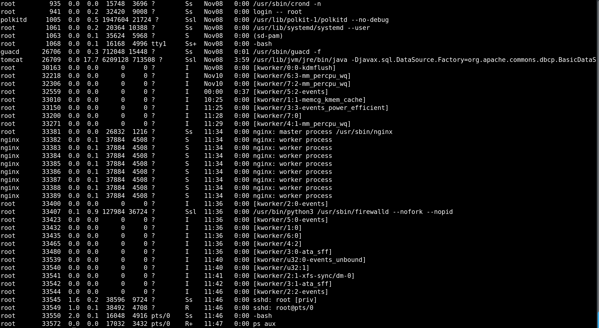

## Linux Processes and Services

CPSC 2810


### Introduction Questions

What's a process?


### Introduction Questions

What's a service?


## Activity

1. Navigate to http://10.0.144.20/ and log in.
2. Open the processes virtual machine


## Processes


### What is a process

A process is a single instance of a program. Each process has a unique process id (PID).


### Viewing Processes

```
$ ps aux
```




### ps aux - important columns

* user - User that owns itp
* PID - (Process ID)
* TTY - TTY it was started in if any
* STAT - Process status (state)
* START - Time the process started
* TIME - How long the process has been running
* COMMAND - Command that was run


### ps arguments

* a = show processes for all users
* u = show more information
* x = show processes not in a tty


## Signals

Signals are a method of communicating with processes. Signals alert a process of an event and have some (limited) freedom to interpret them as they like.


## Signals - Examples

* Pressing Ctrl+c
    - Process receives SIGINT (2)
* Dividing by zero
    - Process receives SIGFPE (8)
* Attempting to access a null pointer
    - Process receives SIGSEGV (11)
* To absolutely, without any doubt, kill a process send SIGKILL (9)


## Signals - More Examples

Not all signals signify something bad has happened though...

SIGUSR (10) and SIGUSR2 (12) are general-purpose and are completely up to the process to interpret


## Signals - Sending

* To send signals we use the kill command.
* *We can send **any** kind of signal with this*


### PID 1

PID 1 is the first process started at boot. It is the init process, handled by the init system, and every other process lives under it.

PID 1 can interpret any signal however it likes. It does not even have to respect SIGKILL

```
$ pstree
```


## Services


### The Init System

Our init system on Ubuntu 18.04 is systemd.

The init system manages services. Starting them on boot, stopping, restarting, etc.


### Starting a Service

Let's say we've installed a web server and we want to finally turn it on.

```
$ systemctl start nginx
```


### Restarting a Service

If it was already started before that would not have reloaded it.

We usually need to restart a service after a configuration change.

```
$ systemctl restart nginx
```


### Querying a Service

Uhh okay... That's nice. Is it actually running?

```
$ systemctl status nginx
```


### Enabling a Service

We rebooted and it didn't start back up.

To make a service start automatically on boot we use enable.

Note that this does **not** actually start it.

```
$ systemctl enable nginx
```


### What happens here?

```
$ systemctl stop nginx
$ systemctl disable nginx
```


### Global Enabled/Disabled Status

```bash
# Show enabled/disabled status of all services
systemctl list-unit-files

# Filter for enabled services
systemctl list-unit-files --state=enabled
```


### Global Started/Stopped Status

```bash
# Show started/stopped status of all services
systemctl list-units -a

# Filter for running services
systemctl list-units -a --state=running
```

