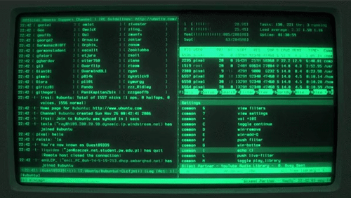
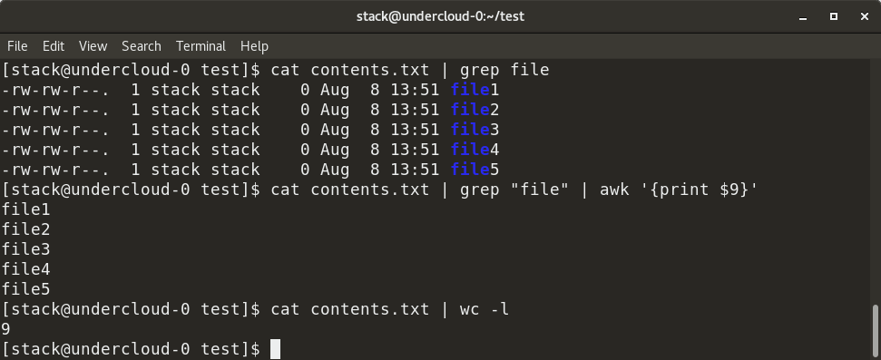
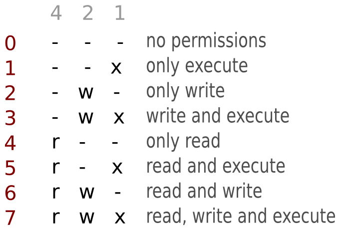

## Introduction to Linux and the Linux Command Line

CPSC 2810


### Introduction Questions

Has anybody used the linux command line before?


### Introduction Questions

Who knows how to do basic file management on the Linux command line?

I.E. Changing directories, moving, deleting, and editing files?


### Introduction Questions

Who knows how to list and interpret Linux file and directory permissions?


### Introduction Questions

Why is it important to have good file permissions in a multi-user system?


### Introduction Questions

In what ways do you think Windows Powershell and the Linux command line are the same? 


## Activity

* There are 6 flags on the system in the format `2810{...a_message...}`
* Find them all and record the messages inside
* You may work in pairs
* The is an (ungraded) quiz on canvas where you can check your answers

Connection instructions at <br>http://linux-intro.vm.cucyber.net/


## What is the command line?

* Windows uses primarily the GUI
* Linux users live in the command line (or at least you will)




## What is the Linux command line?

* Filesystem-first
* We start in our home directory (~, /home/myname/)
* We can list the contents of and move directories (folders)
* We can move, copy, and edit files
* We can run applications to extend capabilities and use them together
 
Note:
Windows dumps you on the desktop and expects you to open applications first.
Linux dumps you in your folder and expects you to find the folder you want to work on first.


## How do I know what commands I can use?

* `help` - What commands can I run?
* `man <command>` - What do these commands do?


## How are commands found?

* Shell built-ins
* The PATH variable contains a list of directories that contains programs that you can run from anywhere
  - `echo $PATH`


## Navigating the Filesystem

* cd - Change directory
* ls - List directory
* less - View a file
* nano - Edit a file
* pwd - Get the current directory
* find - Search for a file


## Arguments

* Arguments are built-in ways to change the behavior of a program
* Try these:
  - `ls`
  - `ls -l`
* You can find a list of arguments in the man page (`man ls`)


## Pipes

Pipes allow us to use the output of one program as the input for another




## Hidden Files

* Hidden files and directories are prepended with a `.`
  - `.bash_history`
* They will not show when you execute `ls` but they will show if you specify `ls -a`
* They help hide the clutter

Note:
There is nothing inheritely special about hidden files. They're just files or folders with a period in front of them


## Permissions

We can change the permissions of a file with the chmod and chown commands


### Chmod

"Change [Permission] Mode"

```
chmod <perms> <filename>
chmod 750 CUCyber_Doc.pdf
```




### Chown

"Change Owner"

```
chown <user>:<group> <filename>
chown weston:cucyber CUCyber_Doc.pdf
```


### Permissions Quiz (Q1)

What are the chmod and chown commands to set the permissions for this file?

```
$ ls -lah
-rw-rw-r--. 1 weston weston 1.8K Oct  7 14:37 6-windows-rolesandgp.md
```