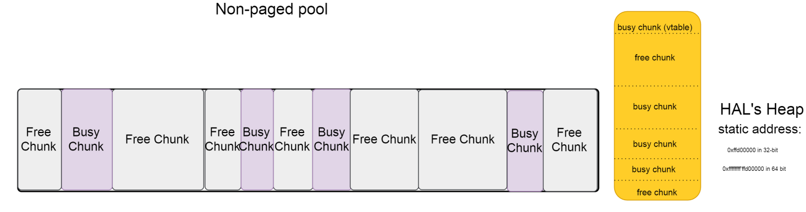
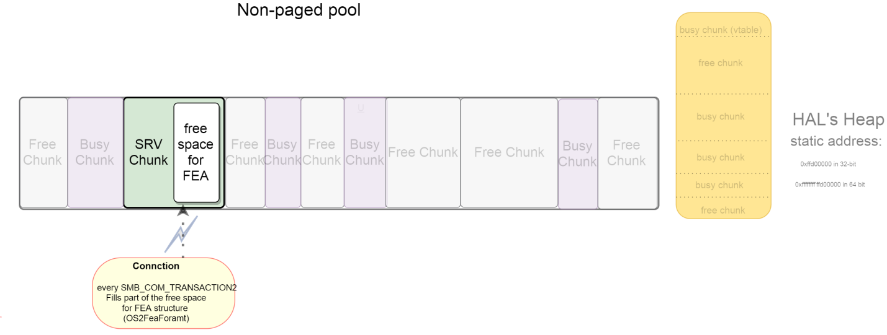
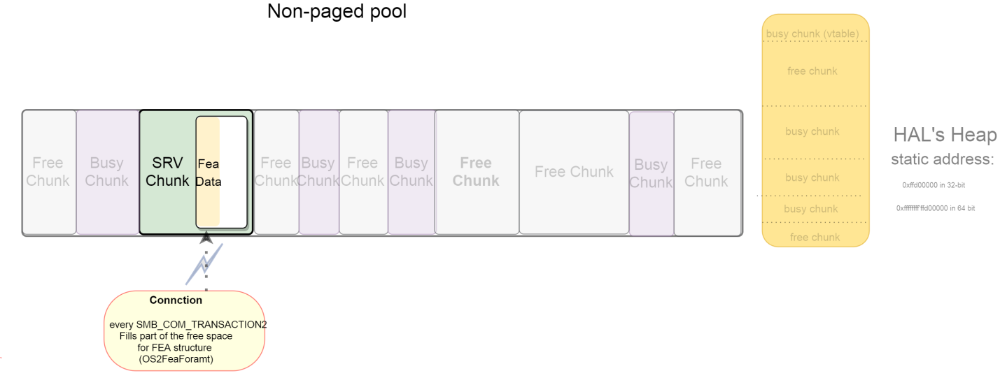
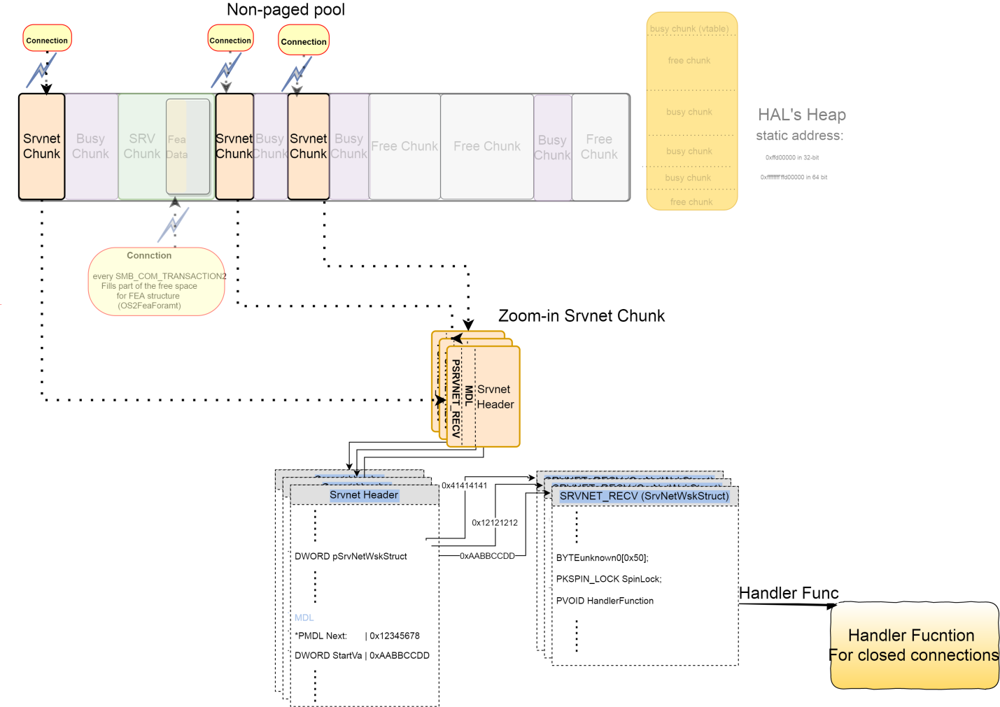
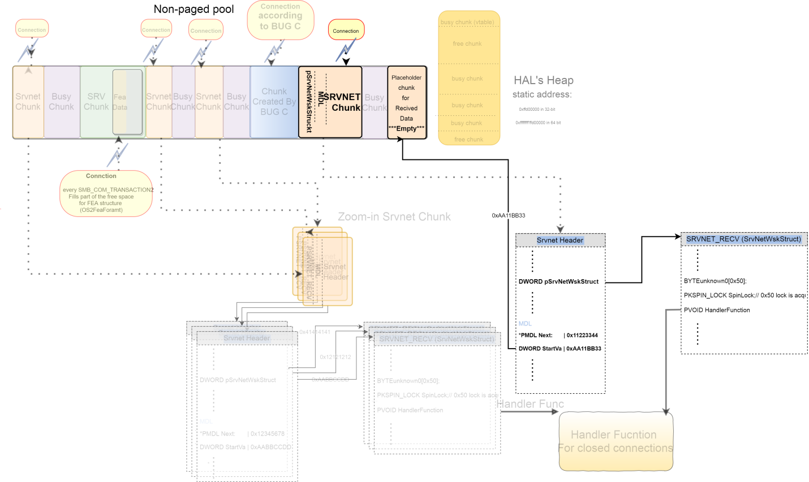
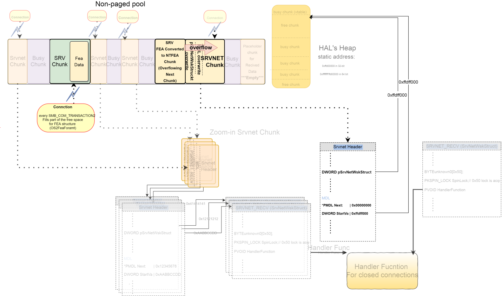
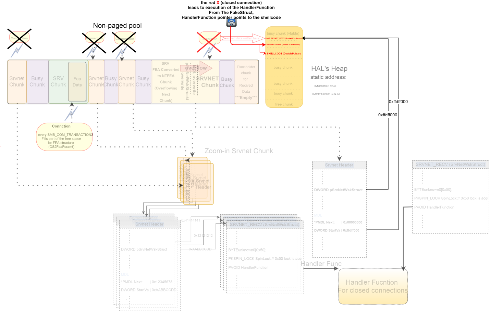

# EternalBlue

CPSC 2810 - Lesson 10

## You Can Find These Presentations Online

Visit [cucyber.net](https://cucyber.net/) to find these presentations and more online!

Material: <a href="https://tldrlegal.com/license/creative-commons-attribution-sharealike-4.0-international-(cc-by-sa-4.0)">Creative Commons Attribution-ShareAlike 4.0</a>Code: <a href="https://tldrlegal.com/license/bsd-2-clause-license-(freebsd)">BSD 2-Clause</a>

## Overview

* SMB 101
* EternalBlue Exploit
* EternalBlue Detection/Remediation

## SMB 101

* Internet file system
* Port 445
* Always seems to have bad security holes

### SMB 101

* Linux has SAMBA
* Windows has SMB features that can be turned on/off
  * Control Panel -> Programs -> Turn Windows Features On/Off
  * Options for SMBv1, SMBv2, SMBv3 (sometimes)

## EternalBlue

* Written by NSA
* Leaked by Shadow Brokers in 2017
* Used in NotPetya
* Autoexploit to SYSTEM
* Boils down to BOF

### 1000 foot explaination

1. Exploit SMB memory allocation operation
2. Write shellcode to connection close handler in memory
3. Close connection
4. ??
5. Profit

#### step 1

#### step 2

### SrvOs2FeaListToNt

* When shrinking a member of `Os2FeaList` actually enlarges it
* `SizeOfListInBytes` is DWORD, but treated like WORD
* The 2 most significant bytes remain untouched
* Before
  * Os2FeaNT->SizeOfListInBytes = 0x10000
* After
  * Os2FeaNT->SizeOfListInBytes = 0x1ff5d
* Wanted
  * Os2FeaNT->SizeOfListInBytes = 0xff5d

#### step 3

#### step 4

#### Grooming

* Hopefully we get a Srvnet buffer allocated next to the FeaList
* This will allow us to overwrite the Close Handler

#### step 5

### The OOB write

* Chunk (Bug C) will be freed
* Fea call will allocate in freed space
* Overflow SRVNET chunk Close Handler
* Execute shellcode

Note:
SRVNET chunk is actually from SMBv2, but buggy chunk is SMBv1

#### step 6

#### step 7

# How to detect

* `Get-SmbConnection`?
* Check for named pipes/post-exploit stuff

## How to remediate

1. Patch `KB4012598`
2. Turn off SMBv1

### Enable SMBv2

`Set-SmbServerConfiguration -EnableSMB2Protocol $false`

### Turn off SMBv1

`Disable-WindowsOptionalFeature -Online -FeatureName SMB1Protocol`

# Questions?

