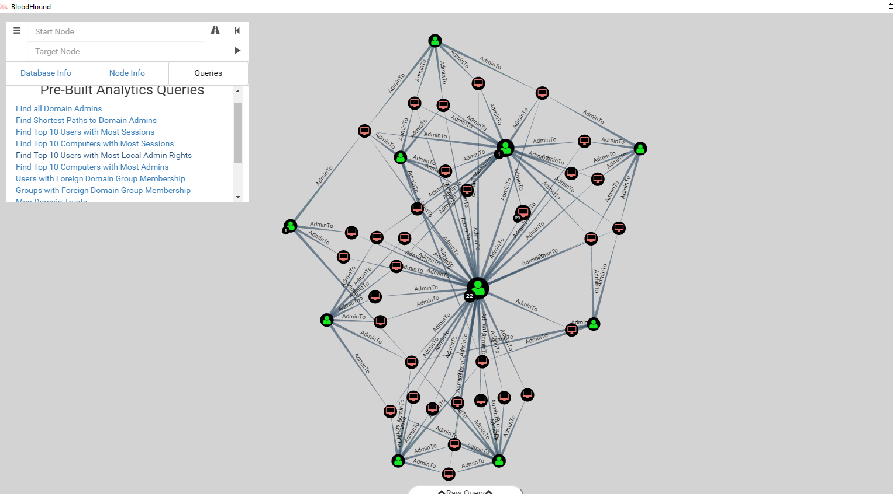

## Advanced Windows Security

CPSC 2810 - Section 11

## You Can Find These Presentations Online

Visit [cucyber.net](https://cucyber.net/) to find these presentations and more online!

Material: <a href="https://tldrlegal.com/license/creative-commons-attribution-sharealike-4.0-international-(cc-by-sa-4.0)">Creative Commons Attribution-ShareAlike 4.0</a>Code: <a href="https://tldrlegal.com/license/bsd-2-clause-license-(freebsd)">BSD 2-Clause</a>

### Objectives

* Understand threat hunting
* Learn about SysInternals Package
  * Sysmon
  * Process Monitor
* Mimikatz
* BloodHound

## What is Threat Hunting?

Note:
Find new threats that don't have signatures

Sherlock Holmes'y

## SysInternals

* Written by the author Mark Russinovich
* https://uri.fooster.io/sys

Note:
He does fiction. Zero Day, Rouge Code, Trojan Horse

### Process Explorer

* "Super Task Manager"
* Good for troubleshooting
  * Handle leaks and locked files
  * Performance
  * Hung processes

### Process Explorer Colors

* Blue - Security context
* Pink - Microsoft-signed services
* Purple - Packed processes

Note:
Why are blue and pink processes useful to know?

### DLL View

* Click DLL Icon in menu
* Find malicious DLLs

Note:
DLLs are "Dynamic-Link Libraries"

### Process Info Screen

* Double click on process
* Virus Total
* TCP/IP tab
* Strings tab

### SMB Named Pipes

* "Find" -> "Find Handle or DLL..." -> \Device\NamedPipe -> "Search"
* List named pipes with process run from

Note:
SMB Named pipes are important because they are powerful C2 tools
Cobalt Strike uses them by default

### SysMon

* Most powerful tool for threat hunting
* Runs as a daemon
* Contains many triggers

### SysMon Triggers

* Process create/terminate
* Driver load/unload
* Network connections
* Create Remote Thread

### SysMon Configuration

* Trigger filters
* Include/exclude fuzzy names
* https://uri.fooster.io/sos

### Mimikatz

* The Opus Magnum of the Windows Security community
* Made by Benjamin Delpy
* `mimikatz is a tool I've made to learn C and make somes experiments with Windows security`

### What is Mimikatz?

* Steals passwords from memory
* Forge Kerberos TGTs (Golden ticket)
* Win Minesweeper

### SAM

* `privilege::debug`
* `sekurlsa::logonpasswords`
* `minesweeper::infos`

## BloodHound

* Creates attack paths in AD environments

### Tools

### Attack Path

# Questions?
