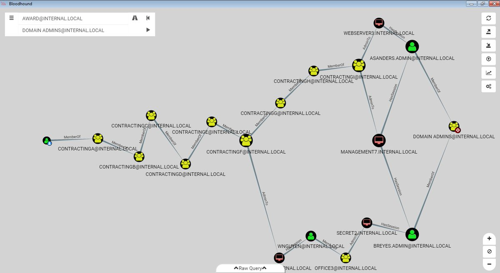

## Windows Security Tools

CPSC 4810

### Objectives

* Learn about SysInternals Package
  * Sysmon
  * Process Monitor
* BloodHound
* Mimikatz

## SysInternals

* Written by the author Mark Russinovich
* Used to manage, troubleshoot Windows systems
* Sysmon, Process Monitor, strings, psexec
* https://live.sysinternals.com

### SysMon

* Most powerful tool Windows for logging
* Runs as a daemon
* Contains many triggers
* https://live.sysinternals.com/Sysmon64.exe

Note:
* `.\Sysmon64.exe -i`
* Get out Windows Server machine
* Navigate to URL and download Sysmon

### SysMon Triggers

* Process create/terminate
* Driver load/unload
* Network connections
* Create Remote Thread

### SysMon Configuration

* Trigger filters
* Include/exclude fuzzy names
* github.com/SwiftOnSecurity/sysmon-config

Note:
`.\Sysmon64.exe -c .\config.xml`

### Process Explorer

* "Super Task Manager"
* Good for troubleshooting
  * Handle leaks and locked files
  * Performance
  * Hung processes
* https://live.sysinternals.com/procexp.exe

### Process Explorer Colors

* Blue - Security context
* Pink - Microsoft-signed services
* Purple - Packed processes

Note:
Why are blue and pink processes useful to know?

### DLL View

* Click DLL Icon in menu
* Find malicious DLLs

Note:
DLLs are "Dynamic-Link Libraries"

### Process Info Screen

* Double click on process
* Virus Total
* TCP/IP tab
* Strings tab

### SMB Named Pipes

* "Find" -> "Find Handle or DLL..." -> \Device\NamedPipe -> "Search"
* List named pipes with process run from

Note:
* SMB Named pipes are important because they are powerful C2 tools
* Cobalt Strike uses them by default

### Mimikatz

* The Magnum Opus of the Windows Security community
* Made by Benjamin Delpy
* `mimikatz is a tool I've made to learn C and make somes experiments with Windows security`

### What is Mimikatz?

* Steals passwords from memory
* Forge Kerberos TGTs (Golden ticket)
* Win Minesweeper

### SAM

* `privilege::debug`
* `sekurlsa::logonpasswords`
* `minesweeper::infos`

## BloodHound

* Creates attack paths in AD environments

### Tools

### Attack Path

### Set up BloodHound

* Install Neo4j
* github.com/BloodHoundAD/BloodHound
