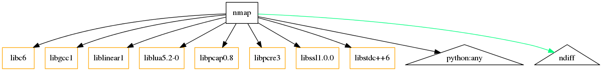

## Linux Package Management

CPSC 2810


### Introduction Questions

How do we install software on Windows?


### Introduction Questions

How do we install software on Linux?


## Activity

1. Navigate to http://10.0.144.20/ and log in.
2. Open the processes virtual machine
3. Use apt to install the package "sl" 
4. Run the command and laugh


## Package Managers


### What is a Package Manager

Linux package managers facilitate installing, updating, and removing packages and their dependencies. 


### What is a dependency

Dependencies are the software packages required to run a software package.

These are automatically handled by the package manager.


### What is a dependency?




### What Package Manager does Ubuntu Have?

Apt is the package manager for Ubuntu. It is built from another package manager called dpkg and using .deb files.


## Apt


### Searching for available packages

```
apt search <package>
```


### Showing more info about a package

```
apt show <package>
```


### Installing a Package

```
apt install <package>
```


### Removing a Package

```
apt remove <package>
```


### Removing a package - Advanced

**Warning** These can be dangerous and cause unintended disasters.

* `apt purge <package>` - Removes the configs associated with packages
* `apt autoremove <package>` - Removes all unneeded dependencies


### Updating package sources

If there is a package that you know exists that apt isn't finding or you are getting errors while downloading a package then your sources are probably outdated.

Solution:

```
apt update
```


### Updating a package

* Update all packages: `apt upgrade`
* Update a single package: `apt upgrade <package>`


## How does Apt know where to install stuff from?


### Apt Sources

The file located at `/etc/apt/sources.list` contains the default mirrors that apt uses.


### Additional sources for software

Sometimes there are packages or versions that aren't available in the default repos. The default repos are very selective and strict about the software that they include.


### Additional Sources - PPAs

https://launchpad.net/ubuntu/+ppas

```
add-apt-repository ppa:<ppa_name>
apt update
apt install <package>
```


### Additional Sources - Manual Install

We can install .deb files manually with dpkg.

Note that this does **NOT** perform dependency management.

`dpkg -i <package_file.deb>`

