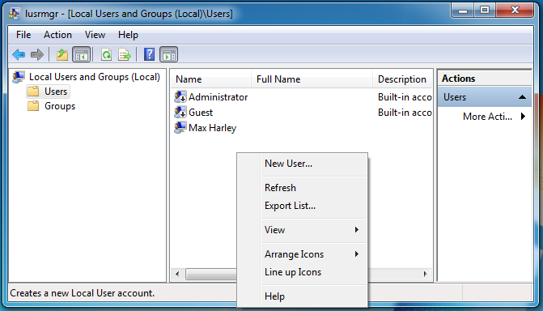
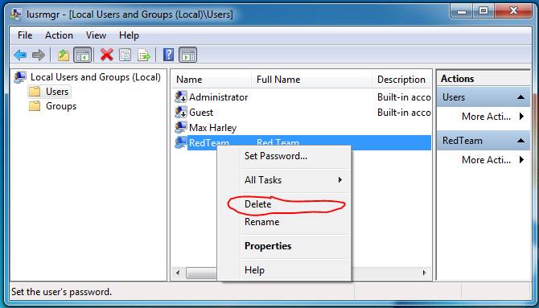
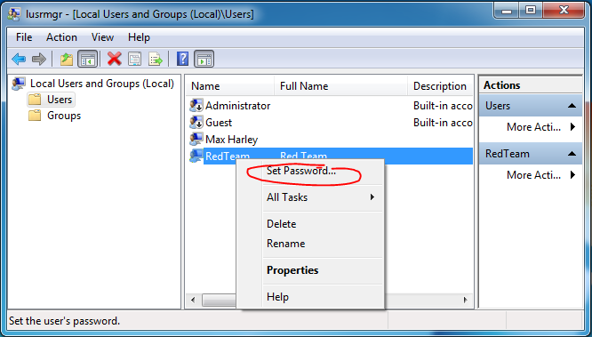

## Windows User Management

CPSC 2810

### Introduction Questions

Step by step on how to add users to Windows

### Introduction Questions

Change password for a user on Windows?

Note:
Specifically for workstation

### Introduction Questions

What is a Windows Administrator?

### Introduction Questions

What is the most popular way for red team to hack into a machine during a competition?

Note:
Default passwords

### Explore

1. Get into groups of two
2. Get onto the lab machine dedicated to this exercise
3. Add a user 
4. Change user password
5. Remove user

Note:
If you need a hint, the Control Panel is a good place to start

## User Management

Open lusrmgr.msc

### How To Add a User

### How to Remove a User

### How to Change a User's Password

### powershell
* Get user - ``PS C:\> Get-LocalUser -Name user`
* Add user (no password) - `PS C:\> New-LocalUser -Name "User02" -Description "Description of this account." -NoPassword`
* Add user (w/ password) - `PS C:\> $Password = Read-Host -AsSecureString`
`PS C:\> New-LocalUser "User03" -Password $Password -FullName "Third User" -Description "Description of this account."`
* Remove user - `PS C:\> Remove-LocalUser -Name "AdminContoso02"`

### net user

* View users - `net user`
* Add user - `net user <username> <password> /add`
* Remove user - `net user <username> /delete`
* Change Password - `net user <username> <password>`
* Change Password Prompt - `net user <username> *`

### Questions?
