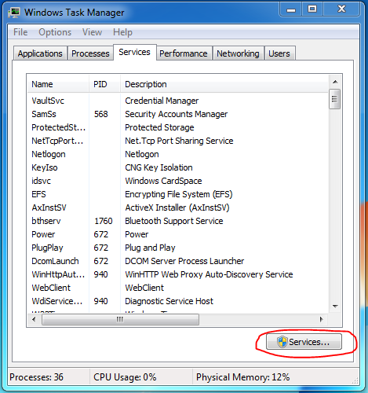

## Windows Processes and Services

CPSC 2810

### Introduction Questions

What is a process?

### Introduction Questions

Why is it good to know what processes are on your computer?

### Introduction Questions

What is a service?

### Introduction Questions

What is an example of a service?

### Introduction Questions

Why is it good to know what services are on your computer?

## Introduction Questions

What is an example of a malicious process? A malicious service?

### Explore - Process

1. Get in pairs
2. Find out how to view processes
3. Create process `iexplore.exe` in Task Manager
4. Open "Properties" of the process
5. Write down the "Location" and "Size"
6. Stop Process

### Processes

* Running application on a computer
* Executable vs process

### How to Start a Process

### How to Stop a Process

### Explore - Services

1. Find out how to view services
2. Start "Smart Card" service
3. Stop "Smart Card" service
4. Open "Properties" of any service
5. Write down "Path to Executable" and "Startup Type"

### Services

* Process that's meant to be run all the time
* Services MSC vs Task Manager
* Service startup type
  * Automatic
  * Manual
  * Disabled
* Typically output is logged to EventViewer
* Permissions based on service account

### Get to Services MSC

### How to start and stop a service

### Properties of Processes

* Process name
* Owner
* Image
* Memory

Note:
What are each of these properties?

### SVCHost

* ServiceHost
* Share process to reduce resource consumption
* Runs a DLL

Note:
* What's a DLL?

### PowerShell Exercise

* Get into pairs
* Using PowerShell
  1. List processes (and all properties 😉)
  2. Create a process (iexplore.exe)
  3. Stop a process

Note:
* What are the advantages of using PowerShell?

### PowerShell

* `Get-Process | select *`
* `Stop-Process`
* `Start-Process`

### Properties of a Service

* Name
* ServiceName
* StartType (manual, automatic)

### PowerShell Exercise

* Get into pairs
* Using PowerShell
  1. List services (and all properties 😉)
  2. Start a service
  3. Stop a service

## Questions?
