## Windows Server - Roles and Group Policy

CPSC 2810

### Introduction Questions

How are servers different than workstations?

### Introduction Questions

What software typically runs on a server?

### Introduction Questions

What is a role on Windows Server?

### Explore

1. Get into pairs
2. Roles
  * Add Web Server role
  * Change the website

### How to add IIS role

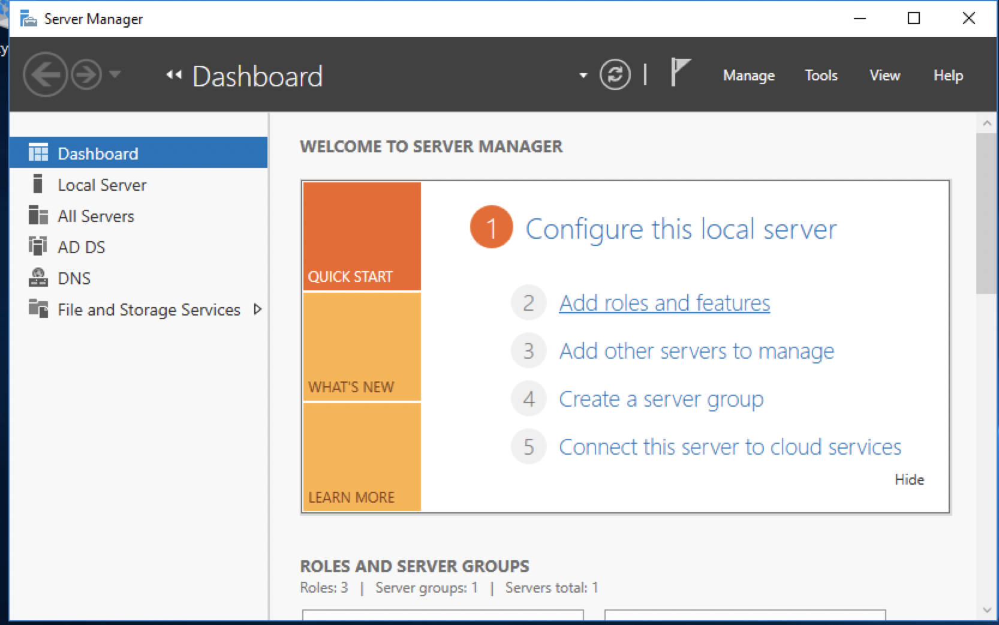

### How to add IIS role

### How to add IIS role

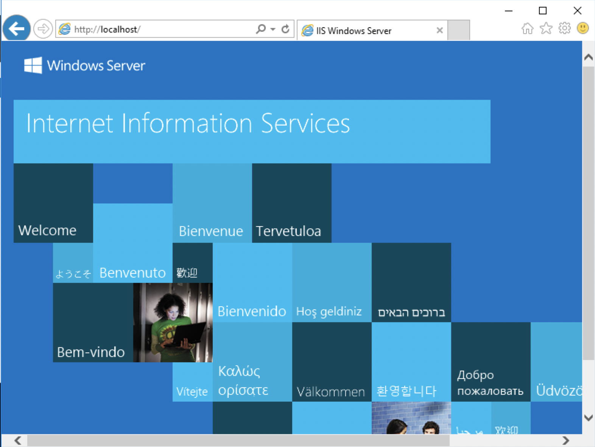

### How to add IIS role

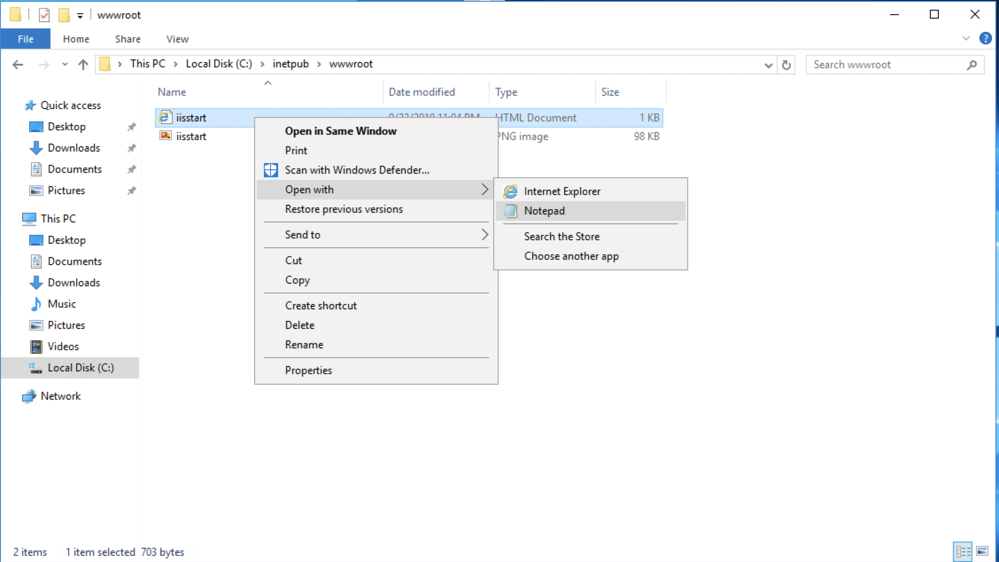

### How to add IIS role

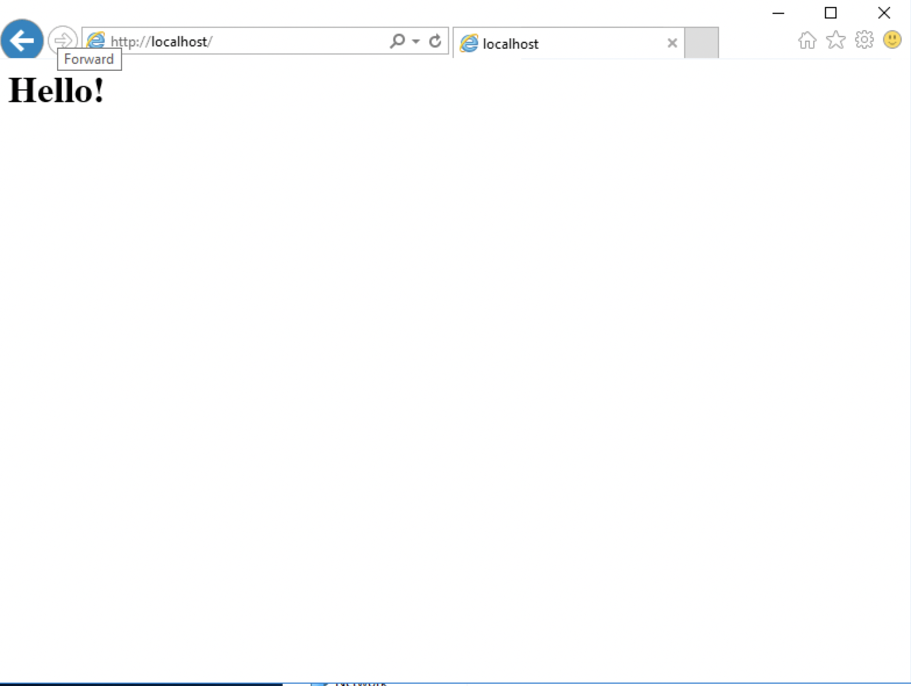

## What are Roles?

* Web server
* Database
* File server
* DNS/DHCP/SMTP 

Note:
That's it. This is a small lecture. Continue on to the next slides

### Introduction Questions

What privileges would a developer need that an accountant wouldn't need and vice-versa?

### Introduction Questions

When would it be useful to have inheritance for Security Policies?

## Explore

1. Get into groups
2. Create two users
3. Put users into a group
4. Create a new GPO
5. Scope the GPO to the group
6. Edit Policy
  * Create a password policy for all users
  * Disable Guest accounts
7. Enforce policy

### How to Manage Group Policy

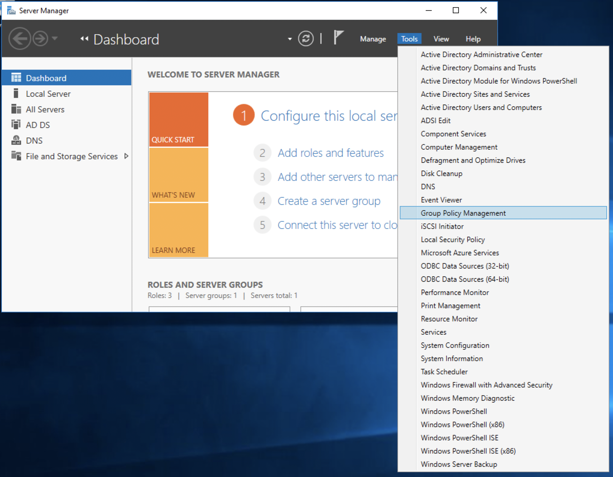

### How to Manage Group Policy

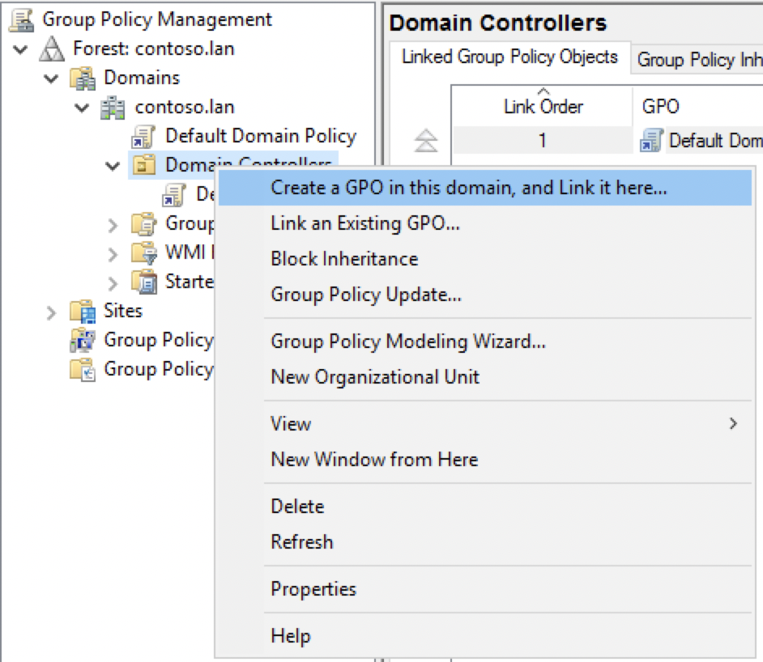

### How to Manage Group Policy

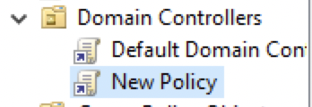

### How to Manage Group Policy

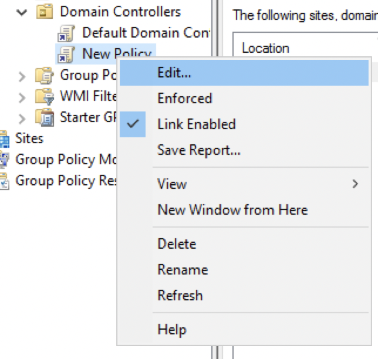

### How to Manage Group Policy

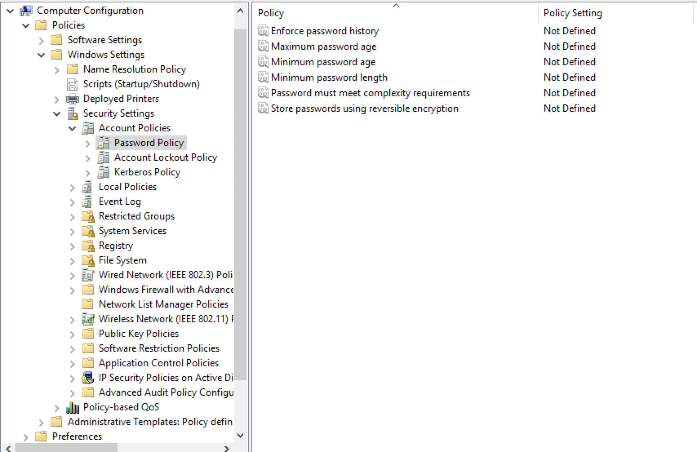

### How to Manage Group Policy

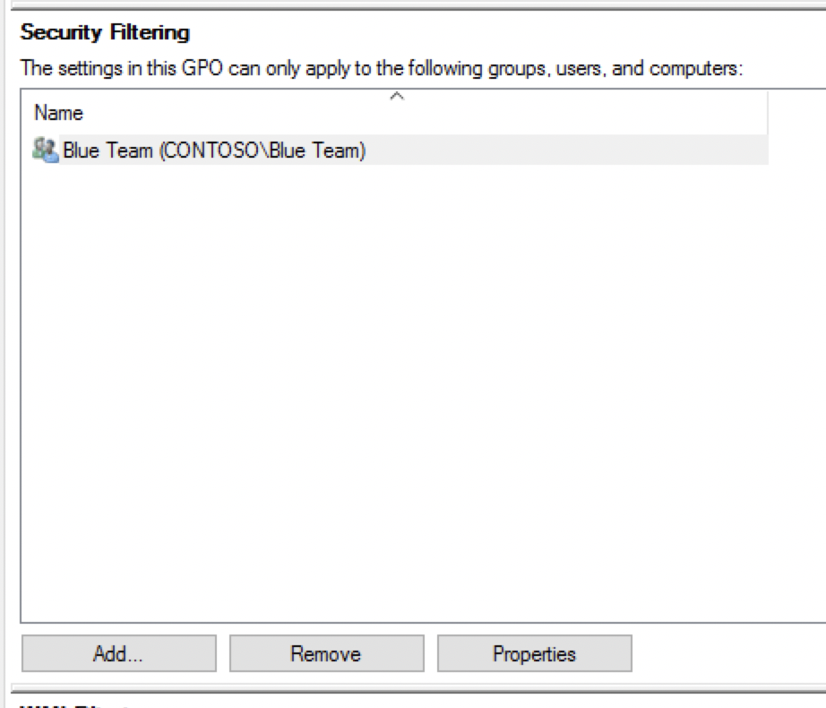

### How to Manage Group Policy

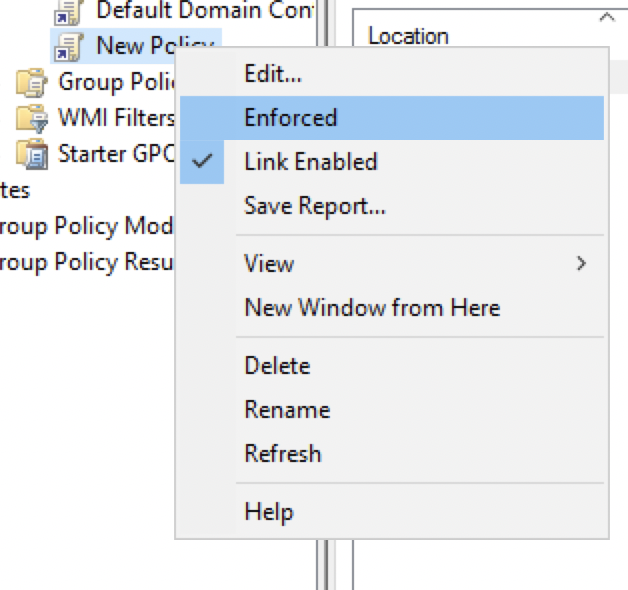

### Group Policy

* LSP but cooler
* Applied to an OU, Domain, Site, Group, or User
* Inheritance

### Why Permissions are Important

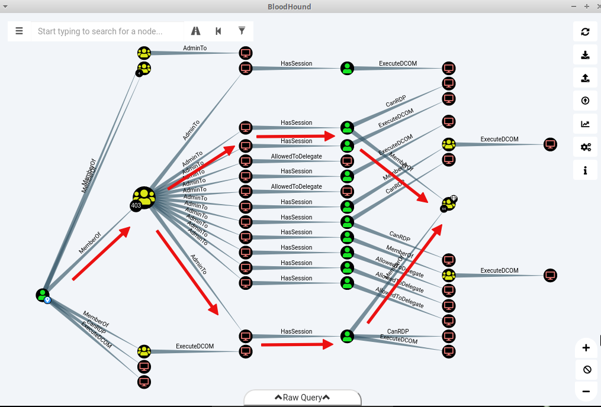

## Questions?
