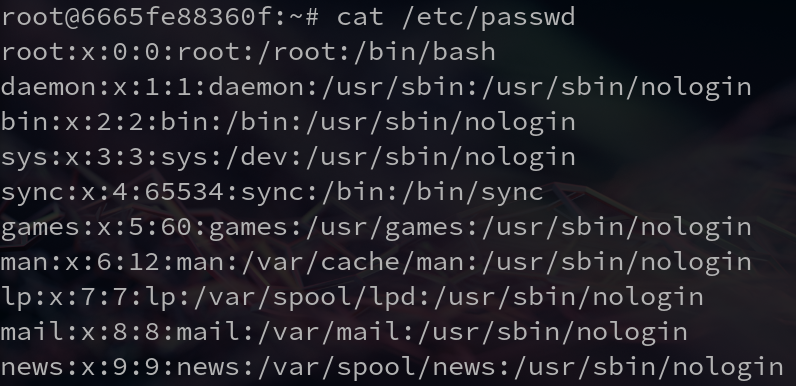
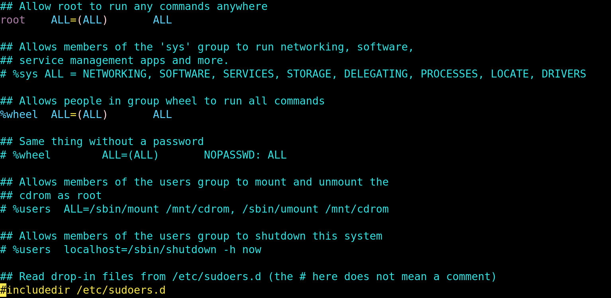

## Linux Users and Groups

CPSC 2810


### Introduction Questions

Who knows how to add and remove users on Linux?


### Introduction Questions

Who knows how to change the password for a user?


### Introduction Questions

Why would you want to add a user to a group on Linux?


### Introduction Questions

Who knows how to escalate to admin from their local user on Linux?


### Introduction Questions

Who knows how to create and enforce a password policy on Linux?


## Activity

1. List all users on the system that begin with the letter "r"
2. List all of the groups that the user "ryan" is a part of.
3. Add a user named "frederick and set his password to "freder1ck-r0cks"


## Activity Solutions

1. List all users on the system that begin with the letter "r"

```
grep ^r /etc/passwd
```


## Activity Solutions

2. List all of the groups that the user "ryan" is a part of.

```
groups ryan
```


## Activity Solutions

3. Add a user named "frederick and set his password to "freder1ck-r0cks"

```
useradd -m frederick -s /bin/bash
passwd frederick
```


## Passwords


### How to change a password

To change the password for a user we use the passwd utility.

Change the password of the current user:

```
cucyber@localhost$ passwd
```

Change the password of another user:

```
root@localhost# passwd cucyber
```


### Where does the system store users?

/etc/passwd

* Username
* User [has = (!)] or [does not have = (\*)] a password
* User ID (UID)
* Group ID (GID)
* Home Directory
* Shell





### Where are the passwords for users stored?

/etc/shadow

* Username
* Encrypted Password
* Days since password was changed
* Days before password can be changed
* Days after which password must be changed
* Days to warn user of expiring password
* Days after expired password that the account is disabled
* Days that an account has been disabled

Note: 
An easy way to check if a user has a password set is to take a peek at the encrypted password field of /etc/shadow


## Where are the passwords for users stored?

What should the permissions for /etc/shadow be?


## Adding and Removing Users


### Adding Users

To add users we use the `useradd` command. See `man useradd` for additional options.

Example: 

`useradd -m -s /bin/bash johnny`

* `-m` = Create a home directory in `/home/` for this user
* `-s /bin/bash` = Set the user's default shell to /bin/bash
* Note: This user will NOT have a password set


### Removing Users

`userdel -r johnny`

* The `-r` flag removes the home directory of the user


### Adding a user to a group

This is a weird one that always trips people up.

`usermod -a -G wheel johnny`

* `-a` = append this group to their list of groups
* `-G wheel` = this is the group we want to add them to


### Viewing the groups for a user

groups <user>


### Viewing all groups on the system

cat /etc/group


### Viewing all members of a group

sudo lid -g <group>


## Sudo


### Sudo

Sudo allows you to run commands as the root user (administrator)

`whoami` -> What's the result?

`sudo whoami` -> What about now?


### Sudoers Groups

Users in the wheel group

* In the default configuration on most systems, the wheel group is permitted to use sudo.
* On some systems it may be the sudo group instead of wheel. 
  - Check your configuration!


### Sudoers Configuration

* /etc/sudoers




## Password Policies 


### What makes a good password policy?


### Installation

sudo apt update

sudo apt install libpam-cracklib


### Changing Password Policy

sudo vim /etc/login.defs


