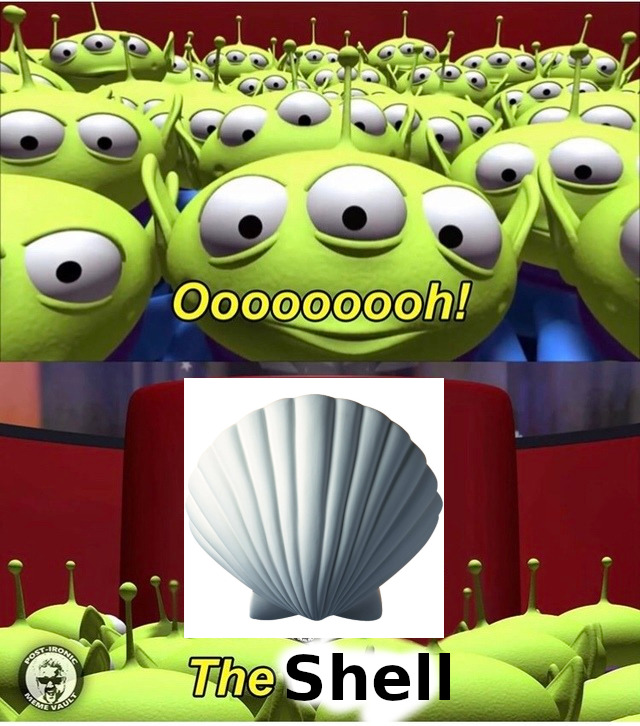

## Living with Linux

# "Software Diversity"

## Linux is fragmented, kinda

* Linux has hundreds if not thousands of distributions or "distros"
* Most of these are completely independent operating systems
* Their common point is the Linux kernel.

## What does each distro do differently?

* Default user software
* System software
* Kernel
* Philosophy
* Branding

## So why are they lumped together?

* Because it's easier
* Most of the software is the same
* There's a lot of cross-development

# Common Distros

## Ubuntu

* Most popular distro
* Beginner friendly
* Server and desktop variants

## Debian

* Ubuntu is based off of this
* Long history of success

## CentOS & Fedora

* CentOS is based off of RHEL
* Fedora is the testing grounds for RHEL
* CentOS is server-focused
* Fedora is desktop-focused

## Arch (btw)

* No installer
* Great documentation

## Gentoo

* What Arch users aspire to be

https://upload.wikimedia.org/wikipedia/commons/1/1b/Linux_Distribution_Timeline.svg

## What are you going to see in the real world?

* Stuff with support contracts and Ubuntu

This leaves:

* Ubuntu
* Red Hat Enterprise Linux
* SUSE

## What are you going to see in a cyberdefense competition?
* Ubuntu
* CentOS/RHEL
* Debian

# Interacting with Linux

## The Shell

## TTY/SSH

* **T**ele**TY**pewriter
* Don't actually call it that or people will make fun of you

## TTY/SSH Pros

* Keyloggers are harder here (not impossible)
* Really easy on the GPU, CPU, and RAM
* More accessible

## TTY/SSH Cons

* No GUIs\*
* Limited flexibility with having multiple instances\*

## GUI Pros

* Increased flexibility and usability
* Play cool games while your code compiles

## GUI Cons

* No centralized desktop environment so they ~~all suck~~ have software diversity

# TTY Survival Handbook

## Rule 1: TUIs are just as good as GUIs

## Rule 2: Scream for Screen

## Rule 3: Man pages can be searched

## Rule 4: UP UP UP

## Rule 5: TAB TAB TAB

## Rule 6: If you're not sure, check the distro

# Activity
