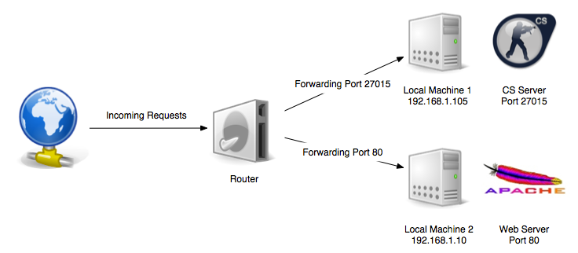

## Intro to Networking

CPSC 4810

### Introduction Questions

What is a port?

### Introduction Questions

What's on port 80?

### Introduction Questions

What's the difference between a router and a switch?

### Introduction Questions

Has anyone ever run a Minecraft server for them and their friends on their home network?

Note:
* Was this available externally?
* How did you do this?

### Introduction Questions

Can anyone summarize NAT?

## Activity

## How do we talk to another computer?

* IP Addresses - A suite of protocols for identification and addressing of connected computers
  - Example: 192.168.1.5
  - Example: 130.127.151.120
  - Example: ipv6 address

## How do we get an IP address?

* DHCP - A server on the network that hands out valid IP addresses within the network
* Static - You define the network and the ip address that your machine will have

## How does traffic get from one host to another?

* Routers all the way down!
* Routers usually have two interfaces
* Each router checks its routing table to determine the next hop
* There is an interface associated and the packet is sent out that interface

## How do we build the routing table?

* Dynamic routing
* Static routing

## Network Segmentation

!()[seccdcq.png]

## Network Segmentation

TODO - Benefits from doc

## Home NAT

* Your home ISP gives you one public IP.
* How do you have multiple devices on your home network?

## Private IP Ranges

* 192.168.0.0/16
  - 192.168.0.0 - 192.168.255.255
* 10.0.0.0/8
  - 10.0.0.0 - 10.255.255.255
* 172.16.0.0/12
  - 172.16.0.0 – 172.31.255.255

## Port Forwarding

## Competition NAT

* At competitions you will be given a block of "public IPs"
* These will usually map directly to your internal IPs
* This is called 1:1 NAT
