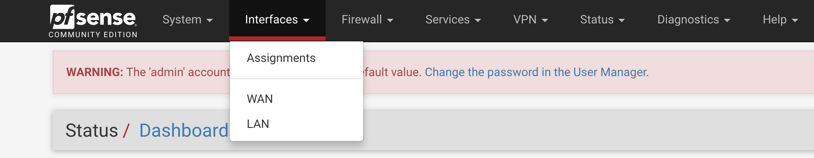
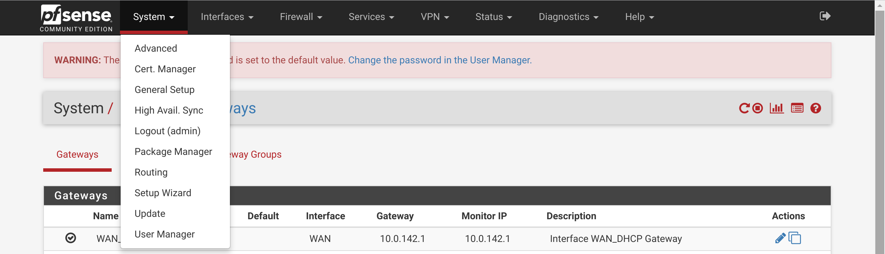
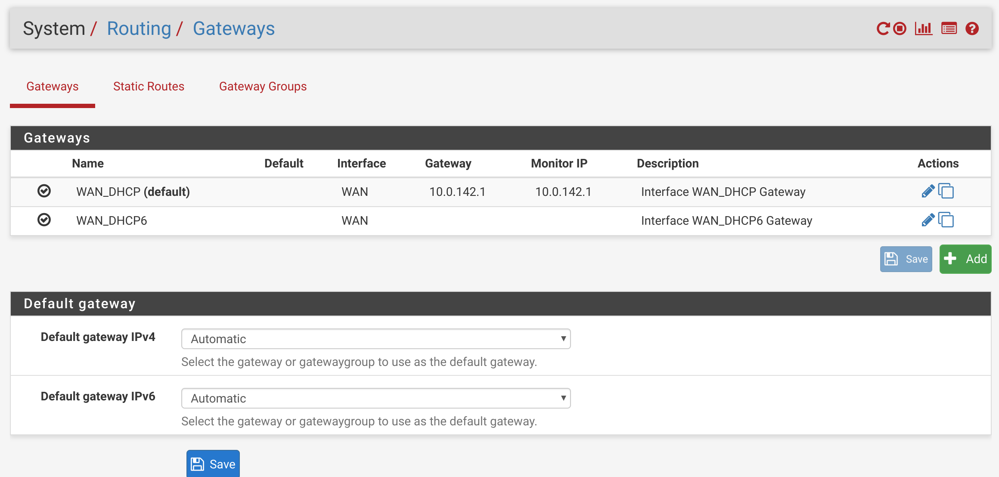
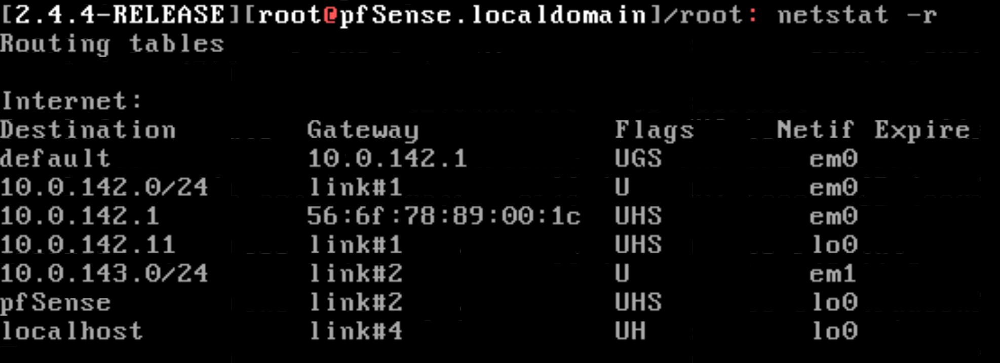
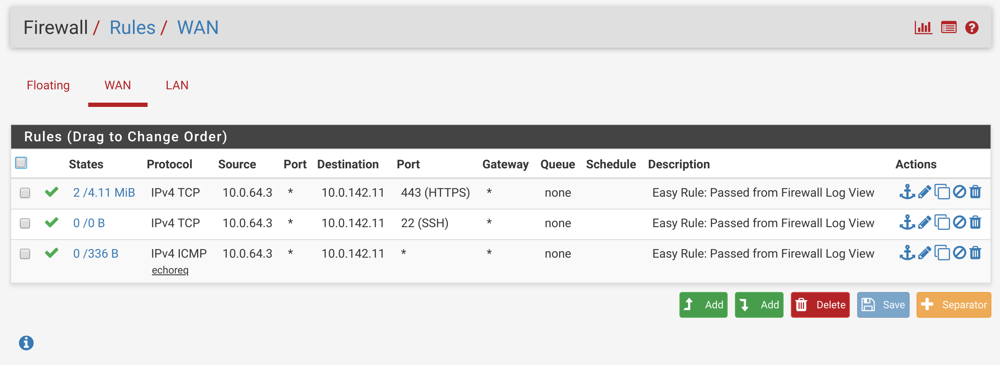
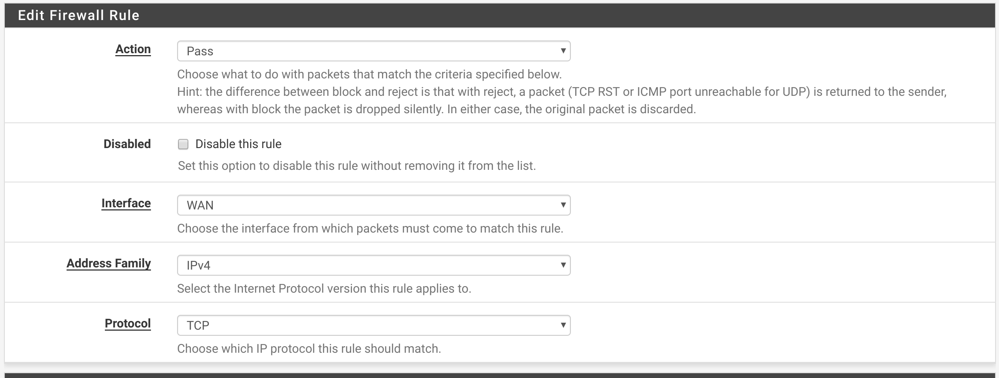
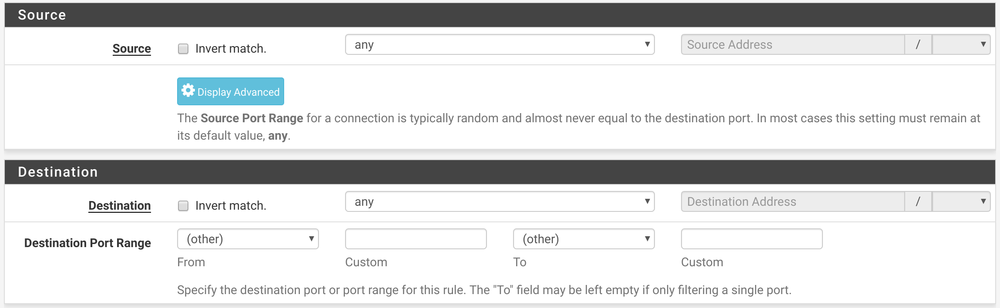
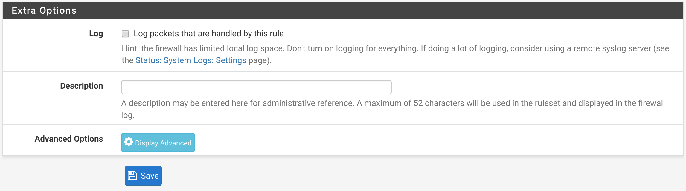
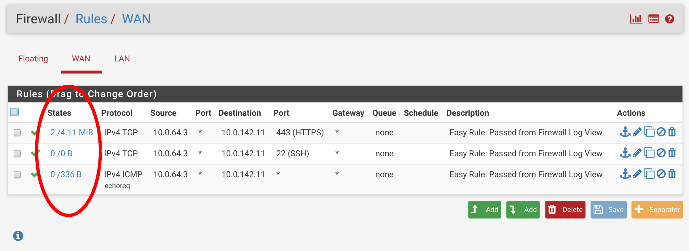
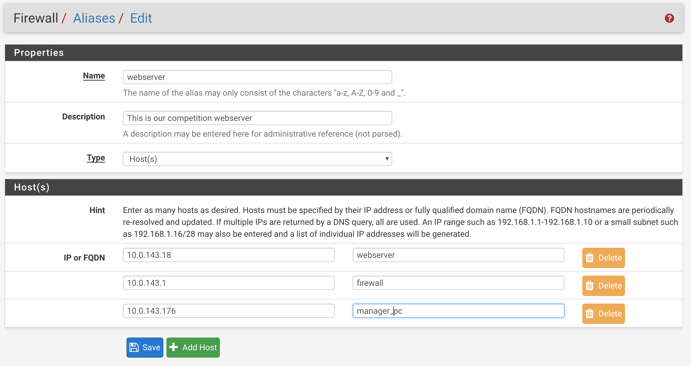

## pfSense Rules

CPSC 4810

### Introduction Questions

What is a firewall rule?

### Introduction Questions

Why are firewall rules on the router important?

### Introduction Questions

If red team controls our firewall what's the worst they can do without just turning it off?

Note:
- MITM, but there are a lot of things they could do

## Interfaces

### Interfaces

pfSense interfaces allow the firewall to communicate with networks.

For the purposes of this class, they will correspond 1:1 with the physical network interfaces on the firewall and behave similarly to the software network interfaces on your computer.

### Interfaces

### WAN Interface

Your WAN interface is your portal to the greater internet.

### LAN Interface

Your LAN interface holds all the devices on your internal network

### Routing

By default, there should exist a route for each interface such that traffic can flow to and from each interface. As such, traffic can flow from one interface to another.

### Routing

The routes menu can be found under System -> Routing

### Routing

### Routing

## Firewall Rules

### Firewall Rules

Firewall rules allow us to permit and deny traffic traveling through our firewall.

There are three chains by default: LAN, WAN, and Floating

They are processed on the inbound direction and are processed in each chain from top down stopping at the first match. Traffic is denied if no rules are matched.

### Firewall Rules

### Default Chains

LAN - Traffic "behind" the firewall

WAN - Traffic coming into the firewall

Floating - Parsed before other chains. Can apply to any interface and direction.

### Additional Chains

Other chains for additional interfaces or VPNs may exist.

They behave similarly.

## Create a Rule

### Create a Rule

### Create a Rule

* Action: Pass, Block, or Reject
* Disabled: True/False
* Interface: Interface from which packets must come to
* Address Family: IPv4, IPv6, or both
* Protocol: TCP, UDP, ICMP, etc

### Create a Rule

### Create a Rule

* Source: The address/network from which the packet originated
* Destination: The address/network where the packet is going

### Create a Rule

### Create a Rule

* Log: True/False (If you want to debug a rule then true)
* Description: The description of what the rule does (and/or why)

## Rule Debugging

### Rule Debugging

Your rules will fail you.

### Rule Debugging

Something will not work and you will not know why.

### Rule Debugging

See previous two slides.

### Rule Debugging - States

To quickly check if a rule is getting trafficked, check the chain's page.

### Rule Debugging - States

### Rule Debugging - Logs

To get a more in-depth listing of rule hits, enable logging on the rule itself.

Visit Status -> System Logs -> Firewall to view these logs.

## IP Groups and Aliases

### Scenario

IPs can be hard to remember and don't mean much.

If our webserver is at 10.0.143.18 then we add an alias called "webserver" and use that instead.

If we have multiple IPs that we want to group together then we can create a group as well.

### Example

Visit Firewall -> Aliases and click "Add" under the IP tab.

### Example

### Example

Important!!!

You cannot refer to the individual components of a group.

To do so, you must create another group with the just individual IP.

Yes it's frustrating. :-)

## Questions?
