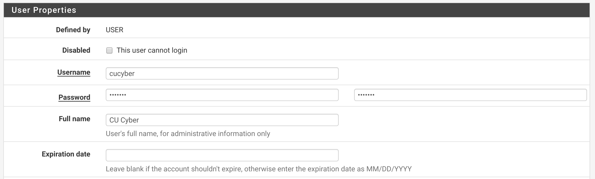
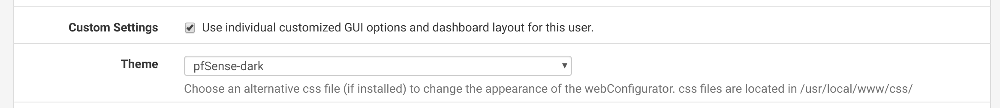

## Advanced pfSense

CPSC 4810

### Introduction Questions

What's the easiest way for red team to get into your firewall?

### Introduction Questions

What's the hardest way for red team to get into your firewall?

### Introduction Questions

If we were given a new, unconfigured firewall without any addresses or routes how quickly could we get back online?

## User Management

### Adding a New User

Navigate to System -> User Management

Click the green Add button to add a new user.

### Adding a New User - Basic Info

### Adding a New User - Hacker Mode

### Adding a New User - Group Membership

IMPORTANT! Add the new user to the admins group so they can actually do something.

### Viewing active connections

Often times at competitions, red team will start with an active session on your firewall.

We want to secure our users and eliminate these sessions.

### Viewing active connections

Navigate to Diagnostics -> States

View connections to the firewall interfaces. Management interfaces are normally on ports 80, 443, 22, and 23, but backdoors could be on any port!

### Audit users

Navigate to System -> User Manager

Here we can see a list of users. Be sure to change their passwords. Kill active connections AFTER changing the password!

### Domain Users

Domain users can be added to pfsense. It's outstanding for home and business setups, but it has no place in cyber defense competition.

System -> User Manager -> Authentication Servers

**You should only see Local Database**

## NAT

### NAT Configuration

View the NAT configuration at Firewall -> NAT.

### NAT Configuration

1:1 NAT allows you to map an external IP to an internal IP.

Port Forward allows you to redirect the traffic for a specific IP and port to another IP and port. This can be extremely useful to trick scoreboards and "move" services to another box.

## DHCP

### A Tale of Two

pfsense has two DHCP services.

"But that's crazy!!"

Correct. Services -> DHCP Server is the one you want.

### DHCP Options

1. Enable on the correct interface
2. Optional: Deny and ignore unknown clients
3. Define the DHCP range
4. Optional: Define additional upstream DNS servers

## Initial Setup

### Scenario

We've factory reset our firewall and we've got 5 minutes to get back online.

### Getting to the console

Visit the console interface of the machine on the lab.

Since there are no interfaces configured we have to do this manually.

### Demo

