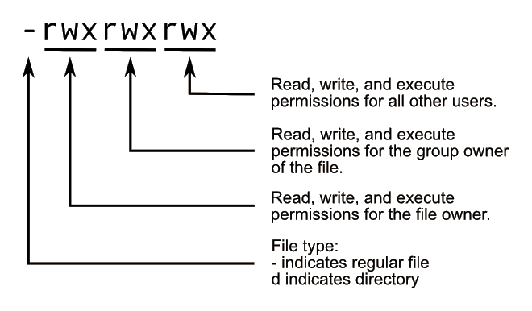

## Intro to Linux & Linux Security

CPSC 2810 - Section 2

## You Can Find These Presentations Online

Visit [cucyber.net](https://cucyber.net/) to find these presentations and more online!

Material: <a href="https://tldrlegal.com/license/creative-commons-attribution-sharealike-4.0-international-(cc-by-sa-4.0)">Creative Commons Attribution-ShareAlike 4.0</a>Code: <a href="https://tldrlegal.com/license/bsd-2-clause-license-(freebsd)">BSD 2-Clause</a>

## Overview

* An introduction to Linux-based distributions and basic Linux security principles.

## Learning Objectives

* Review basic command line tools: `ls`, `cd`, `top`, `ss`, `grep`
* Learn the basics of file permissions, users, and groups
* Know basic services (SSH, FTP, SMTP, HTTP)

## Learning Objectives

* Understand the separation of privilege in a Linux system via UIDs specific to services and users
* Know how to start and configure a firewall using either ufw, firewalld, or iptables

## Intro to Linux

### Command Review

* `ls` - list directory contents
	- `ls -la`
* `cd` - change directory
	- `cd dir`
* `top`/`htop` - display linux processes
* `ss` - socket statistics
	- `ss -tlpn`
* `grep` - print lines matching a pattern
	- `grep -rnw "pattern"`

### Linux File Permissions

Note:
On Linux, each file and directory is assigned access rights for the owner of the file, the members of a group of related users, and everybody else. Rights can be assigned to read a file, to write a file, and to execute a file (i.e., run the file as a program). Executable permissions on a directory allows one to `cd` to it.

|num|         perm           |mode|bits|
|:-:|:----------------------:|:--:|:--:|
|7  |read, write, and execute|rwx |111 |
|6  |read and write          |rw- |110 |
|5  |read and execute        |r-x |101 |
|4  |read only               |r-- |100 |
|3  |write and execute       |-wx |011 |
|2  |write only              |-w- |010 |
|1  |execute only            |--x |001 |
|0  |none                    |--- |000 |

Note:
You will often here of the phrase “`chmod 777`”. The change mode command alters a file’s mode bits. It does so using octal numbers. The first number indicates the 3 bit number associated with the owner of the file, the second number indicates the group related to the file, and lastly the third indicates all other users.

### Linux Users and Groups

* `su` - run a command with substitute UID & GID
	- `su - user`
* `sudo` - temporarily become the superuser
	- `sudo apt update`
* `chmod` - modify file access rights
	- `chmod +x file.sh`
* `chown` - change file ownership
	- `chown user:group file.txt`

Note:
As you just learned, you can use chmod to change the mode bits of a file. Chown is used to change the user and/or group of a file. This can be useful when restricting untrusted users from potentially sensitive files. su and sudo can be used to alter your current sessions uid (user id) and gid (group id).

#### UID

* A user ID (UID) is a unique positive integer assigned by a Unix-like operating system to each user.
* Each user is identified to the system by its UID, and user names are generally used only as an interface for humans.

#### UID

* UIDs are stored in "/etc/passwd".
* UID 0 is **always** root.
* `cat /etc/passwd`

#### GID

* A group ID (GID) is a unique positive integer assigned by a Unix-like operating system to each group.
* Valid group numbers are given in "/etc/group", and in the GID field of "/etc/passwd" file.
* For each UID added, there is a corresponding GID

Note:
There is a corresponding GID so that you can assign the group field of a file to only that user.

#### Common UIDs

* root
* daemon
* bin
* sys
* man
* www-data
* rtkit

Note:
Rtkit stands for RealtimeKit NOT rootkit. Pulseaudio uses it.

#### Common GIDs

* sudo
* wheel
* ssh
* syslog

### Common Linux Services

|Service| Application |Port|
|:-----:|:-----------:|:--:|
|HTTP   |Apache/Nginx | 80 |
|FTP    |Vsftpd/Proftp| 21 |
|SSH    |OpenSSH      | 22 |
|SMTP   |Postfix/Exim4| 25 |

Note:
The most common services present during a competition are HTTP, FTP, SSH, and SMTP. It’s almost guaranteed that every single one of these shows up. If HTTP is present, then a server has a web server set up and it is serving a specific web page. If FTP is present, then there is likely a requirement for outside users to upload documents. If SSH is present, the scenario calls for users to remotely connect and perform actions on a linux server. Lastly, if SMTP is present, there is a mail server that must send and receive emails correctly. This can be used for receiving injects/deliverables/business tasks and is typically important.

### Local Firewalls

* iptables
* firewalld
* UFW

#### firewalld

* Enable and start firewalld:
	- `sudo systemctl enable --now firewalld`
* Check the status of firewalld:
	- `sudo firewall-cmd --state`
* List all configurations for all zones:
	- `sudo firewall-cmd --list-all-zones`
* Add HTTP to the default zone
	- `sudo firewall-cmd --add-service=http --permanent`
* Add FTP to the public zone
	- `sudo firewall-cmd --zone=public --add-service=ftp --permanent`

#### firewalld

* Reload the firewalld configuration:
	- `sudo firewall-cmd --reload`
* Add an arbitrary port:
	- `sudo firewall-cmd --zone=public --add-port=1234/tcp --permanent`
* Remove an arbitrary port:
	- `sudo firewall-cmd --zone=public --remove-port=1234/tcp --permanent`

#### UFW

* Enable UFW:
	- `sudo ufw enable`
* Disable UFW:
	- `sudo ufw disable`
* Check the status of UFW:
	- `sudo ufw status verbose`

Note:
UFW (uncomplicated firewall) is another very popular option when managing your local firewall. UFW is the default firewall for Ubuntu. Developed to ease iptables firewall configuration, ufw provides a user friendly way to create an IPv4 or IPv6 host-based firewall. **By default UFW is disabled.**

#### UFW

* Allow HTTP:
	- `sudo ufw allow http`
* Allow an arbitrary port (TCP and UDP):
	- `sudo ufw allow 1234`
* Allow an arbitrary port on a specific protocol:
	- sudo ufw allow 1234/tcp

#### iptables

* Three default chains:
	- INPUT: Manages incoming packets
	- OUTPUT: Manages outgoing packets
	- FORWARD: Manages packets that need to be delivered elsewhere

* Match first
	- iptables starts at the beginning of a chain and stops as soon as it finds a rule that matches
	- If we reach the end of a chain then the default policy is applied

#### iptables

* List rules
	- sudo iptables -L

* Change the default policy for a chain
	- sudo iptables -P INPUT DROP
	- sudo iptables -P OUTPUT ACCEPT

* Allow SSH traffic (22/tcp)
	- sudo iptables -A INPUT -p tcp --dport 22 -m conntrack --ctstate NEW,ESTABLISHED -j ACCEPT

# Questions?
