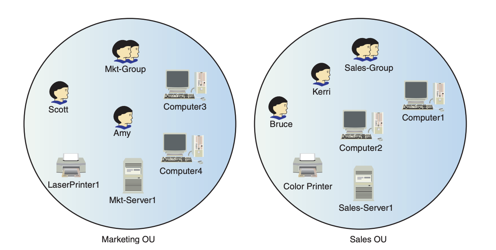
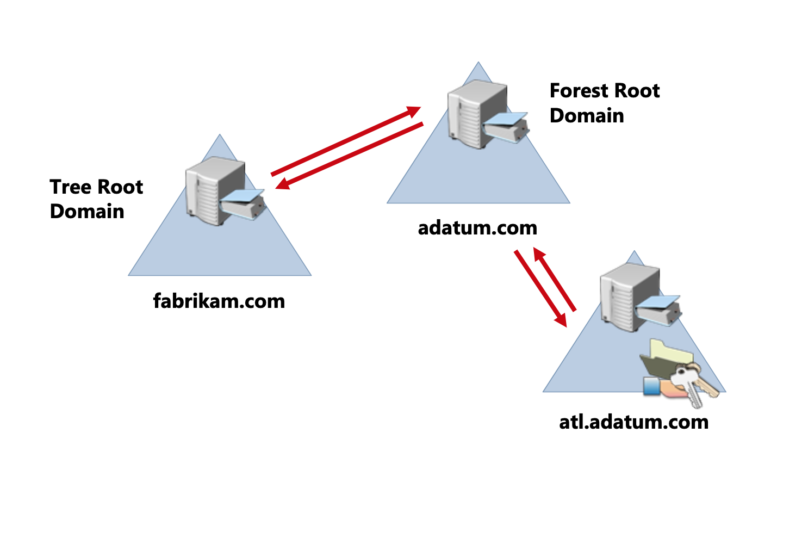
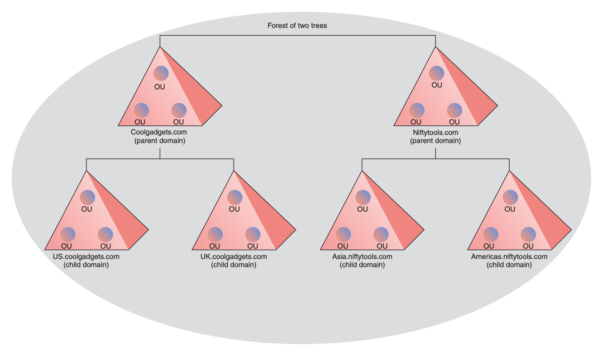

# Active Directory Domain Services

CPSC 4810

## Summary

* What is AD/DS?
* Parts of an AD
  * OU
  * AD
  * Site
  * Forest

## What is AD/DS?

* Microsoft branded directory service
* Directory service is a hierarchical arrangement of objects
  * Users
  * Computers
  * Services
* Has security options built-in

Note:
* Definition of LDAP
* Difference between AD/DS and LDAP

### Services included in AD/DS

* Domain Services - Data storage & communication
* Certificate Services - Encryption
* Lightweight Directory Services (LDAP)
* Directory Federation Services - SSO on mail, web, etc
* Rights Management

Note:
* What are certificates
* Why is rights management important in this scenario

### Domain Controller (DC)

* A server running AD/DS is called DC
* Runs a number of services:
  * Kerberos Key Distribution Center (kdc)
  * NetLogon (Netlogon)
  * Windows Time (W32time)
  * Intersite Messaging (IsmServ)
* Connect multiple domains to create forest

Note:
* Why would forests be useful?

## Parts of an AD

### Organizational Unit

* Container component that organizes leafs like users, groups, etc
* The icon is a folder
* Apply Group Policy to entire OUs

Note:
* What is Group Policy?

### Example

### Active Directory

* Container component that contains OUs
* Talked about it already

Note:
* Why is an AD a container component?

### Site

* Location of an "office"
* Assign permissions based on "sites"

### Forest

* Container component that contains ADs
* Tree of ADs
* "Root domain"
* Group of ADs
* Security boundary

### Example

### Example

