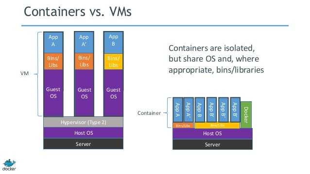

## Docker

CPSC 2810 - Section 2


## You Can Find These Presentations Online

Visit [cucyber.net](https://cucyber.net/) to find these presentations and more online!

<span style="padding-top: 6em; font-size: 0.4em; float: left;">Material: <a href="https://tldrlegal.com/license/creative-commons-attribution-sharealike-4.0-international-(cc-by-sa-4.0)">Creative Commons Attribution-ShareAlike 4.0</a></span><span style="padding-top: 6em; font-size: 0.4em; float: right;">Code: <a href="https://tldrlegal.com/license/bsd-2-clause-license-(freebsd)">BSD 2-Clause</a></span>


## Overview

* We will cover what Docker is, how it is used in corporate environments, and how we can use it during a competition.


## Learning Objectives

* Understand what Docker is
* Understand Docker's use in a corporate environment
* Be able to execute basic Docker commands
* Understand how misconfigurations in a Docker container can impact your security


### Intro to Docker


* What is Docker?
* Why would you want to use it?
* How is it used in the real world?
* How is it used in a cyberdefense competition?

Note:
Answer all of these questions for the class


### How is Docker different from a VM?




### Installing Docker

* `sudo apt install docker.io`

Note:
Or go the long way and install it using docker's repos.


### The Docker Group

Note:
* What does it mean for a user to be a part of the Docker group? What permissions does that give them?
* Can this be dangerous in a security context?


#### Docker Commands

* `man docker-run`
 - Show the man page for running commands in a new container
* `docker run -it ubuntu /bin/bash`
 - Pull (if not available) and run /bin/bash in the default Ubuntu image
* `docker ps -a`
 - Show all containers (default shows just running)

Note:
Show in class what happens when you run `docker run -it ubuntu /bin/bash` and explain it.


#### Docker Commands

* `docker images`
 - Show Docker images
* `docker stop <container-id>`
 - Stop the specified Docker container
* `docker stop $(docker ps -aq)`
 - Stop ALL Docker containers


#### Docker Commands

* `docker rm --force $(docker ps -aq)`
 - Remove ALL Docker containers
* `docker rmi --force $(docker images -aq)`
 - Remove ALL Docker images


#### Dockerfiles

* Each Dockerfile is a script, composed of various commands (instructions) and arguments listed successively to automatically perform actions on a base image in order to create (or form) a new one.

Note:
* They are used for organizing things and greatly help with deployments by simplifying the process start-to-finish.
* Think of them like blueprints.


##### Dockerfiles

```
# Pull base image.
FROM ubuntu:16.04
RUN apt update && apt install cron sudo -y
# Create a lab user and add it to the sudoers file
RUN useradd -ms /bin/bash week2lab \
	&& echo "week2lab:week2lab" | chpasswd \
	&& adduser week2lab sudo
# Add User files, Crontab, and "Malware"
ADD sources.tar.xz /
# Define entry user.
USER week2lab
WORKDIR /home/week2lab
# Launch into a shell on entry.
CMD ["bash"]
```

Note:
This is the dockerfile used to generate the week 2 lab.


#### Docker Image Security

* Don’t put passwords in Dockerfiles because they can be reversed
 - https://github.com/P3GLEG/Whaler
* Docker Hacking
 - https://github.com/cr0hn/dockerscan

Note:
* Analyze: Looking for sensitive information in a Docker image.
 - Looking for passwords in environment vars.
 - Try to find any URL / IP in the environment vars.
 - Try to deduce the user used internally to run the software.
* Extract: extract a docker image
* Info: Get a image meta information
* Modify:
 - entrypoint: change the entrypoint in a docker
 - trojanize: inject a reverser shell into a docker image
 - user: change running user in a docker image


## Questions?


## Lab


## Homework


## Extra Credit Opportunity

* There will be a talk on IoT infrastructure and security on a global scale in the Watt Family Innovation Center in Room 208.
* If you attend this talk for the entire duration, you will receive a 10% bonus on the next Red vs. Blue report.
