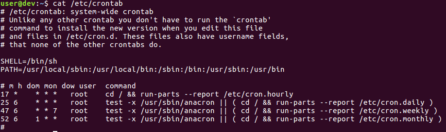

## Intro to Linux & Linux Security

CPSC 2810 - Section 2

## You Can Find These Presentations Online

Visit [cucyber.net](https://cucyber.net/) to find these presentations and more online!

Material: <a href="https://tldrlegal.com/license/creative-commons-attribution-sharealike-4.0-international-(cc-by-sa-4.0)">Creative Commons Attribution-ShareAlike 4.0</a>Code: <a href="https://tldrlegal.com/license/bsd-2-clause-license-(freebsd)">BSD 2-Clause</a>

## Overview

* An introduction to Linux-based distributions and basic Linux security principles.

## Learning Objectives

* Identify common Linux distributions (Ubuntu, CentOS, Fedora, Debian, Arch, etc.).
* Identify common Linux package managers (apt and dnf/yum).
* Use basic command line tools such as ls, cd, cat, mv, grep, tar, ss, ip, top, chmod, chown and sudo.
* List the names of the folders of the Linux directory hierarchy.
* Explain the purpose of /etc/passwd, /etc/shadow, and /etc/group.
* Explain how Linux file permissions, users, and groups work.
* Identify malicious programs in a crontab entry.

## Intro to Linux

### What is Linux?

* Linux is a kernel

Note:
The kernel is a computer program that is the core of a computer's OS. It has complete control over everything in the system. The kernel acts as the intermediator between the OS and the computer's hardware.

### Linux-based Distributions

* There are multiple operating systems (distributions or distros) based on Linux
* Major differences include:
 - Supported desktop environments (e.g. GNOME, KDE, Xfce)
 - Package managers that define how software is installed and updated
 - Core services (e.g. systemd, cron, avahi)

#### Commercially Supported

* Ubuntu (Canonical Ltd.)
* Fedora (Red Hat)
* RedHat Enterprise Linux (Red Hat)

#### Community-Driven

* Debian
* Arch Linux
* Gentoo
* CentOS

### Package Managers

* Package Manager Demo

Note:
Show installing gcc by source and by package manager. Explain what the point of a package manager is and why it is useful to use one/why Linux distros have one.

#### Distros By Package Manager

##### APT

Frontend: aptitude
* Debian
* Ubuntu (Xubuntu, Lubuntu, etc.)
* Kali

Note:
APT stands for Advanced Package Tool

##### RPM

Frontends: yum and DNF
* RedHat Enterprise Linux
* CentOS
* Fedora

Note:
RPM is a recursive acronym for RPM Package Manager

##### Others

* Arch - Pacman
* Gentoo - Portage

#### Takeaway

|Linux Distro|Package Manager|
|:-:|
|Ubuntu|Apt|
|CentOS|Dnf/Yum|

* There are a lot of linux-based distros.
* They manage their software through "package managers".

Note:
If you're going to take any notes, this is what you'd want to do.

### Common Commands

Note:
Ask the students if they are familiar with any specific commands and have them say what each command does. If they are unable to name commands, move to the next slide and explain each one.

### Common Commands

* `ls` - list directory contents
    - `ls -la`
* `cd` - change directory
    - `cd dir`
* `cat` - read files
    - `cat file`
* `mv` - move files or directories
    - `mv /foo/bar/fileA /bar/foo/fileB`
* `grep` - print lines matching a pattern
    - `grep -rnw "pattern"`
* `tar` - create/extract tar archives
    - `tar -czvf folder.tar.gz folder/`

### Common Commands

* `ss` - socket statistics
    - `ss -tlpn`
* `ip` - show/manipulate network interfaces
    - `ip a`
* `top`/`htop` - display linux processes
* `chmod` - modify file access rights
    - `chmod +x file.sh`
* `chown` - change file ownership
    - `chown user:group file.txt`
* `sudo` - temporarily become the superuser
    - `sudo apt update`

### Pipes

* To direct output (stdout) of one program and feed it to the input (stdin) of another

  `<cmd1> <args1> | <cmd2> <args2>`

* `cat /etc/passwd | grep "user"`

### Linux Directory Hierarchy

* / - the top directory, everything is under this
* /bin - executable programs
* /etc - config files
* /home - user home directories
* /root - the root user’s home directory
* /opt - programs installed without a package manager
* /var - log files
* /tmp - temporary files

Note:
Not all of this will immediately click, but it gets easier/more familiar the more time you spend with it.

### Linux File Permissions

Note:
On Linux, each file and directory is assigned access rights for the owner of the file, the members of a group of related users, and everybody else. Rights can be assigned to read a file, to write a file, and to execute a file (i.e., run the file as a program). Executable permissions on a directory allows one to "cd" to it.

|num|         perm           |mode|bits|
|:-:|:----------------------:|:--:|:--:|
|7  |read, write, and execute|rwx |111 |
|6  |read and write          |rw- |110 |
|5  |read and execute        |r-x |101 |
|4  |read only               |r-- |100 |
|3  |write and execute       |-wx |011 |
|2  |write only              |-w- |010 |
|1  |execute only            |--x |001 |
|0  |none                    |--- |000 |

Note:
You will often here of the phrase "chmod 777". The change mode command alters a file’s mode bits. It does so using octal numbers. The first number indicates the 3 bit number associated with the owner of the file, the second number indicates the group related to the file, and lastly the third indicates all other users.

### Linux Users and Groups

* `sudo` - temporarily become the superuser
    - `sudo apt update`
* `chmod` - modify file access rights
    - `chmod +x file.sh`
* `chown` - change file ownership
    - `chown user:group file.txt`

Note:
As you just learned, you can use chmod to change the mode bits of a file. Chown is used to change the user and/or group of a file. This can be useful when restricting untrusted users from potentially sensitive files. su and sudo can be used to alter your current sessions uid (user id) and gid (group id).

#### UID

* A user ID (UID) is a unique positive integer assigned by a Unix-like operating system to each user.
* Each user is identified to the system by its UID, and user names are generally used only as an interface for humans.

#### UID

* UIDs are stored in "/etc/passwd".
* UID 0 is **always** root.
* `cat /etc/passwd`

#### GID

* A group ID (GID) is a unique positive integer assigned to each group.
* Valid group numbers are given in "/etc/group", and in the GID field of "/etc/passwd" file.
* For each UID added, there is a corresponding GID

Note:
There is a corresponding GID so that you can assign the group field of a file to only that user.

#### Common Users

* root
* daemon
* bin
* sys
* man
* www-data
* rtkit

Note:
Rtkit stands for RealtimeKit NOT rootkit. Pulseaudio uses it.

#### Common Groups

* sudo
* wheel
* ssh
* syslog

### /etc/passwd

Note:
cat /etc/passwd locally

### /etc/shadow

Note:
cat /etc/shadow locally

### /etc/group

Note:
cat /etc/group locally

### Crontab

* Used to run tasks at scheduled times

#### Crontab

# Questions?

# Homework

Note:
Homework is OverTheWire levels 1->15

# Lab

Note:
Lab is a command line tutorial in a docker container.
