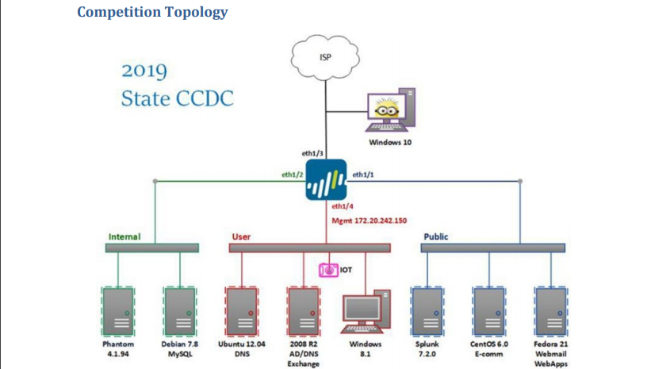

# Red vs Blue (#1)

CPSC 4810

## Summary

* What is RvB
* Network Layout
* Group work
  * Assign Roles
  * Strategy
  * Hackpack

## What is RvB

* Red Team
* Blue Team
* Gold Team

## Network Layout

## Group Work

### Assign Roles

* Assign roles for each box on the network

### Strategy

* 30 min "Go Plan?"
* Which parts from the hackpack do you need
* How will injects get done?

### Hackpack

* Print off parts of hackpack that will be needed
* Write some pages specifc to the competition
