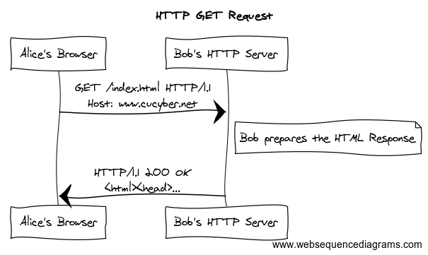

## Secure Service Setup

CPSC 2810 - Section 2


## You Can Find These Presentations Online

Visit [cucyber.net](https://cucyber.net/) to find these presentations and more online!

<span style="padding-top: 6em; font-size: 0.4em; float: left;">Material: <a href="https://tldrlegal.com/license/creative-commons-attribution-sharealike-4.0-international-(cc-by-sa-4.0)">Creative Commons Attribution-ShareAlike 4.0</a></span><span style="padding-top: 6em; font-size: 0.4em; float: right;">Code: <a href="https://tldrlegal.com/license/bsd-2-clause-license-(freebsd)">BSD 2-Clause</a></span>


## Learning Objectives

* Identify Apache, Nginx, OpenSSH, Bind9, MySQL, and VSFTPd as common services
* Identify Linux and Windows configuration locations
* Identify misconfigurations in common services


## Secure Service Setup


### Services

Note:
Be able to identify misconfigurations in Apache, Nginx, OpenSSH, Bind9, MySQL, and VSFTPd


#### What is a service?

* An application that:
 - waits for a request from a client (internal or external)
 - processes this request
 - sends an appropriate response to the client

Note:
Generally, or at least in the context of a defense competition, a computer service is an application that waits for a request from a client (internal or external), processes this request, and will usually send some sort of response back to the client.


#### Service Example




#### How are Services Configured?


##### Linux

* Service configuration files can be found in the /etc/ directory.
 - For example, the configuration for openssh can be found at /etc/ssh/sshd_config
 - For more information on Linux folder hierarchy, type `man hier`.


##### Windows

* On Windows, service configurations are found in the installation directory.
 - For example, an Apache configuration might be in C:\Program Files\Apache\conf\httpd.conf.


#### How do we manage services?


##### Linux

* Most services can be started, turned off, and restarted via the init system.
* For most recent releases of popular linux distributions this is systemd and can be controlled with the command systemctl.
* In older releases it can be slightly different and inconsistent between distros, but the general idea is the same.


###### Systemctl Commands

* systemctl status
* systemctl status <service>
* systemctl [start|stop|restart] <service>
* systemctl [enable|disable] --now <service>

Note:
You've been exposed to this a bit when using firewalld.


###### Init.d

`/etc/init.d/service {start|stop|status}`


##### Windows

* Services are managed through an internal service management resource.
* It can be accessed with Powershell by <Verb>-Service (Get-Service).
* To show currently running services:
 - Get-Service | ?{$_.Status -eq "Running"}


###### Powershell Commands

* New-Service
* Restart-Service
* Resume-Service
* Set-Service
* Start-Service
* Stop-Service
* Suspend-Service
* Remove-Service


#### How do we access services?

* HTTP: you can use curl or your browser to specify port numbers by using the scheme:
 - http://website:port/
* SSH: you can specify a specific port with the scheme:
 - ssh ip-address:port
* For FTP, you can specify a specific port with an optional argument:
 - ftp ip-address port

Note:
Services are often hosted on non-standard ports. For example, HTTP might be on 8080 instead of 80 and SSH might be on 2222 instead of 22.


### Securing Services


#### General Principles


##### Network Traffic

* There should be not be unencrypted data transferred inside or outside the network
* Unencrypted data has the potential to be intercepted, modified, or replayed by a malicious actor on the network.
* This can be especially important during a cyber defense competition where any machine could potentially be compromised.


##### Permissions and Authorization

* Principle of Least Privilege
 - Do not set up the web server with the root account.
* Ensure that the local permissions are acceptable
* Ensure that external connections are limited to what is absolutely necessary
* Ensure that all users have proper access controls


#### Configuration Changes

* After each configuration change, you **must** restart the service or the change will not take effect.


#### Common Services at Cyber Defense Competitions


##### HTTP/S Servers

* Apache (Linux)
* Nginx (Linux)
* IIS (Windows)


###### Apache

* Disable version info string
 - /etc/apache2/apache2.conf
 - ServerSignature Off
 - ServerTokens Prod
* Disable directory browsing
 - /etc/apache2/apache2.conf
```
<Directory /var/www/html>
		Options -Indexes
</Directory>
```


###### Apache

* Enable Security and Evasive Modules
 - `sudo apt-get install libapache2-modsecurity`
 - `a2enmod "mod_security" and "mod_evasive"`
* Disable CGI and Server Side Includes
 - Options -Includes
 - Options -ExecCGI


###### Nginx

* Disable version info string
 - /etc/nginx/nginx.conf
 - server_tokens off;
* IP Restrictions
 - /etc/nginx/sites-enabled/default
```
location /wp-admin/ {
	allow 192.168.1.1/24;
	allow 10.0.0.1/24;
	deny  all;
}
```


###### Nginx

* Audit the Server
 - `sudo apt-get install wapiti`
 - `wapiti http://example.org -n 10 -b folder`


##### DNS

* Bind9 (Linux)
* Active Directory (Windows)


##### SSH

* OpenSSH (Linux)


###### OpenSSH

* Deny Root Login
 - etc/ssh/sshd_config
 - PermitRootLogin no
* Limit User Logins
 - /etc/ssh/sshd_config
 - AllowUsers alice bob


###### OpenSSH

* Disable Protocol 1
 - /etc/ssh/sshd_config
 - Protocol 2
* Use Public/Private Keys for Auth (/etc/ssh/sshd_config)
 - Put pubkey in ~/.ssh/authorized_keys
 - PasswordAuthentication no


##### FTP

* VSFTP (Linux)
* WarFTP (Windows)


###### VSFTP

* Enable connections (/etc/hosts.allow)
 - vsftpd: ALL # Allow all connections
 - vsftpd: 10.0.0.0/255.255.255.0 # IP Address Range
* Chroot jail list
 - /etc/vsftpd.conf
 - chroot_list_enable=YES
 - chroot_list_file=/etc/vsftpd.chroot_list
   + List of users that are jailed


###### VSFTP

* Chroot jail local users (/etc/vsftpd.conf)
 - chroot_local_user=YES
 - Chroot_list_file are users NOT in a chroot jail
* Limiting user login
 - /etc/vsftpd.conf
 - userlist_enable=YES
 - userlist_file=/etc/vsftpd.user_list
   + List of users that are NOT able to login
 - userlist_deny=NO
   + List of users that ARE able to login


##### DB

* MySQL/MariaDB (Linux Usually)
* Postgres (Both)
* MongoDB (Linux)
* MS SQL Server (Windows)


###### MySQL

* MySQL Secure Installation
 - `sudo mysql_secure_installation`
* Bind to Localhost
 - /etc/mysql/my.cnf
 - bind-address = 127.0.0.1
* Disable Local File Loading
 - /etc/mysql/my.cnf
 - local-infile=0


###### MySQL

* Securing the Database from Within
 - `mysql -u root -p`
* Get all Users, Hosts, and Passwords
 - `SELECT User, Host, Password FROM mysql.user`
* If a Password is Empty
 - `UPDATE mysql.user SET Password=PASSWORD(newpass) WHERE User="test-user";`


###### MySQL

* If a Host is "%"
 - `UPDATE mysql.user SET Host='localhost' WHERE User="demo-user";`
* Delete Blank Users
 - `DELETE FROM mysql.user WHERE User="";`
* Reload New Privileges
 - `FLUSH PRIVILEGES;`


##### HTTP/S Webapps

* Wordpress (Windows usually)
* Joomla! (Linux)
* Custom Webapps


##### SMTP

* Exim4 (Linux)
* Postfix (Linux)


##### POP3/IMAP

* Dovecot (Linux)


## Common Services


### Protocol Activity

* FTP
* SSH
* HTTP
* SMTP
* DNS

Note:
* Give the port number and actual services that implement these protocols


## Common Misconfigurations


### FTP Server

```
listen=YES
local_enable=YES
write_enable=YES
xferlog_file=YES

anonymous_enable=YES
anon_root=/var/http/html

chown_uploads=YES
chown_username=apache2
```


### Web Server

```
Port 80

User apache2
Group apache2
DocumentRoot "/var/http/html"

<Directory /var/http/html>
  Options +Indexes
  AllowOverride None
  Order allow,deny
  Allow from all
</Directory>

```


### DNS

```
zone "example.com" in{
  notify "yes";
  file "/var/named";
  allow-transfer {192.168.0.3;};
};
```


### SSH

```
Port 22
ListenAddress 192.168.1.1
HostKey /etc/ssh/ssh_host_key
ServerKeyBits 1024
LoginGraceTime 600
KeyRegenerationInterval 3600
PermitRootLogin yes
IgnoreRhosts yes
IgnoreUserKnownHosts yes
StrictModes yes
X11Forwarding no
```


## Questions?


## Homework


## Lab
