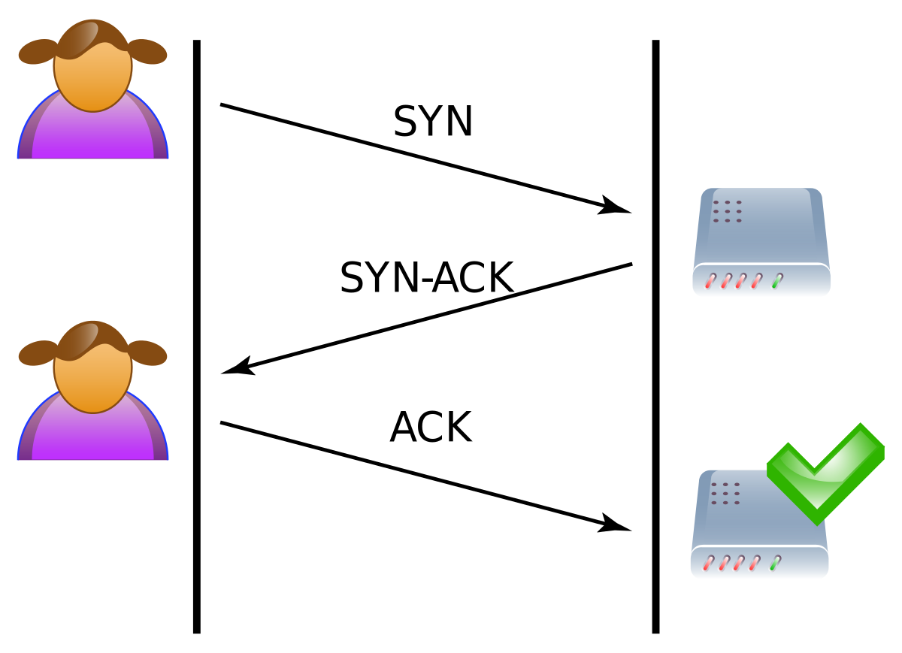

## Activity

* Open Wireshark and navigate to a website
* Discuss with your partner what you think you are seeing

## Discussion

## Big Picture

## Intro to Networking and Network Security

CPSC 2810 - Section 2

## You Can Find These Presentations Online

Visit [cucyber.net](https://cucyber.net/) to find these presentations and more online!

Material: <a href="https://tldrlegal.com/license/creative-commons-attribution-sharealike-4.0-international-(cc-by-sa-4.0)">Creative Commons Attribution-ShareAlike 4.0</a>Code: <a href="https://tldrlegal.com/license/bsd-2-clause-license-(freebsd)">BSD 2-Clause</a>

## Overview

* An introduction to networking and basic network security principles.

## Learning Objectives

* Compare and contrast IPv4 and IPv6 IP Addresses.
* Compare the similarities and differences between TCP and UDP.
* Identify common ports (21, 22, 25, 80, and 443).
* Associate the common ports with their protocols.
* Name the layers of the OSI model.

## Intro to Networking

## OSI Model

Note:
* Open Systems Interconnection model
* Conceptual model
* Describes the functions of a networking or telecommunication system abstractly
* Does not concern itself with the implementation details

### Layer 1 - Physical Layer

* Electricity, Ethernet Cords, Physical devices

### Layer 2 - Data Link Layer

* Responsibilities
    - Getting data to/from the physical layer
    - Error correction from the physical layer
    - Hardware addressing (i.e. framing)
* Grouping of data is called frames
* Uses MAC Addresses to communicate

Note:
* Ethernet Frames

### Layer 3 - Network Layer

* Responsibilities
    - Routing
* Can send arbitrary data
* Grouping of data is called packets
* Uses global addresses to communicate

Note:
* Route selection finds the "best" path, not necessarily the shortest path.
* Higher layers (than 3) determine format and further structuring.
* Where layer 2 uses MAC addressing, layer 3 uses IP addressing. (lead-in to ARP later)

#### IP Addresses

##### What is an IP Address?

* An IP address is a numerical label assigned to each device connected to a computer network that uses the Internet Protocol for communication.
* An IP address serves two principal functions
    - host or network interface identification
    - location addressing

Note:
In the same way that your mailman needs an address to deliver mail to your house, computers need an address to know where to send data to talk to each other.

##### IPv4 and IPv6

* IPv4
    - 32-bit Addresses
    - Written in dot-decimal notation
    - Private and Public Addresses
        + Private - 192.168.1.1
        + Public - 130.127.151.120
* IPv6
    - 128-bit Addresses
    - Written in the form of eight groups of four hexadecimal digits
    - 2001:0db8:85a3:0000:0000:8a2e:0370:7334

### Layer 4 - Transport Layer

* Responsibilities
    - How much data do we send?
    - Error detection
* TCP and UDP

### TCP and UDP

#### TCP

* Transmission Control Protocol is a standard that defines how to establish and maintain a network conversation via which application programs can exchange data.
* TCP provides reliable, ordered, and error-checked delivery of a stream of bytes.

#### TCP

* TCP is defined as being:
    - Connection-oriented
    - Stream-based
    - Increased network overhead

Note:
Connection-oriented: TCP has a three-way handshake that is performed to establish a connection. This is in the form SYN, SYN-ACK, ACK.
Stream-based: Packets are transmitted in order ("1... 2... 3...") in a continuous stream. If a packet fails to transmit, it will be retransmitted.
Increased network overhead: TCP packets have a large header which creates a lot of overhead.

##### TCP 3-Way Handshake

##### Examples of TCP

Note:
Example uses of TCP are World Wide Web (WWW), E-mail, File Transfer Protocol, Secure Shell, peer-to-peer file sharing, and streaming media applications.

### UDP

* User Datagram Protocol is an alternative communications protocol to TCP used primarily for establishing low-latency and loss-tolerating connections between applications on the internet.
* UDP provides checksums for data integrity, no handshake, and no guarantee of delivery, ordering, or duplicate protection.

### UDP

* UDP is defined as being:
    - Connectionless
    - Message based
    - Real-time
    - Order-less

Note:
Connectionless: Connections do not need to be established for UDP packets to be transmitted.
Message based: "Fire and forget" motto.
Real-time: Time-sensitive applications often use UDP because dropping packets is preferable to waiting for packets delayed due to retransmission, which may not be an option in a real-time system.
Order-less: It does not matter in what order the packets of a UDP connection arrive.

#### Examples of UDP

Note:
An example use is VoIP or online gaming.

### Layer 5 - Session Layer

#### Ports

##### What is a Port?

* A port is a number that designates a communication channel
* A service is a long running application that listens on a particular address and port
* Most services have a default port, but can be reassigned if need be.

#### Protocols

##### FTP 21

* What: File Transfer Protocol 
* Why: Used to transfer files from one computer to another.

##### SSH 22

* What: Secure Shell
* Why: SSH is used to log in to remote computers.

##### SMTP 25

* What: Simple Mail Transfer Protocol
* Why: Used to transfer emails between computers.

##### HTTP 80

* What: HyperText Transfer Protocol
* Why: Web server! Any time you go to a website, HTTP is used.

#### Nmap

* Nmap is a tool used to map/explore networks and scan ports
* We can use nmap to identify any open ports/protocols on our hosts.

Note:
Why might we want to know about the open ports or protocols on our system?

##### Nmap Demo

Note:
* nmap scanme.nmap.org

#### Common Nmap Scans

Note:
Open the CU Cyber hackpack Nmap section: https://cucyber.net/documents/hackpack.html#common-options

### Layer 7 - Application Layer

* Responsibilities
    - Communicating data and metadata between applications

Note:
* Sender works from top down; receiver works from bottom up.
* What kind of processes do you think appear here? Chrome and Word do not live here, but it does include applications that allow Chrome and Word to access networked information.

### Wireshark

* Used for identifying network activity on a computer

#### Wireshark Demo

### Questions?

### Homework

### Lab
