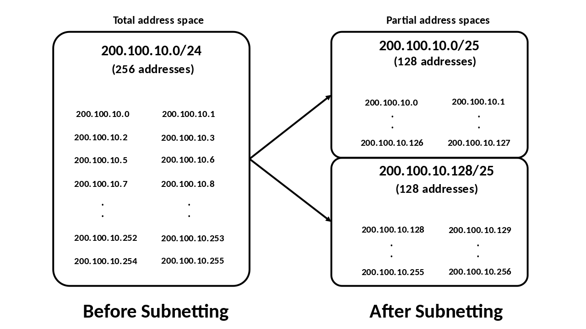

## Intro to Networking and Network Security

CPSC 2810 - Section 2

## You Can Find These Presentations Online

Visit [cucyber.net](https://cucyber.net/) to find these presentations and more online!

Material: <a href="https://tldrlegal.com/license/creative-commons-attribution-sharealike-4.0-international-(cc-by-sa-4.0)">Creative Commons Attribution-ShareAlike 4.0</a>Code: <a href="https://tldrlegal.com/license/bsd-2-clause-license-(freebsd)">BSD 2-Clause</a>

## Overview

* An introduction to networking and basic network security principles.

## Learning Objectives

* Review basic network topology (IP Addresses, Ports, Subnets)
* Review Transport Layer (TCP/UDP)
* Know basic Application Network Protocols (DNS, ARP, DHCP)
* Understand the difference in switches (managed, unmanaged)
* Understand the basics of firewalls (stateful, stateless, signature based, rules)
* Understand the uses of network zones (DMZ, internal, external, vlan)

## Intro to Networking and Network Security

### IP Addresses, Ports, and Subnets

Note:
Review basic network topology (IP Addresses, Ports, Subnets)

#### IP Addresses

##### What is an IP Address?

* An IP address is a numerical label assigned to each device connected to a computer network that uses the Internet Protocol for communication.
* An IP address serves two principal functions
	- host or network interface identification
	- location addressing

Note:
In the same way that your mailman needs an address to deliver mail to your house, computers need an address to know where to send data to talk to each other.

##### IPv4 and IPv6

* IPv4
	- 32-bit Addresses
	- Written in dot-decimal notation
	- Private and Public Addresses
		+ Private - 192.168.1.1
		+ Public - 130.127.151.120
* IPv6
	- 128-bit Addresses
	- Written in the form of eight groups of four hexadecimal digits
	- 2001:0db8:85a3:0000:0000:8a2e:0370:7334

#### Ports

##### What is a Port?

* A port is a number that designates a communication channel
* A service is a long running application that listens on a particular address and port
* Most services have a default port, but can be reassigned if need be.

Note:
Firewalls (eg. UFW and network firewalls) are able to block communications by port rather than allow all or no traffic.
For example, the service secure shell (SSH) listens on port 22, Apache (a web server) listens on port 80 (the default HTTP port) and possibly 443 (the default HTTPS port), and DNS services listen on port 53 (the default DNS port).

##### Sockets

* A process can refer to a socket using a socket descriptor, a type of handle.
* Unlike ports, sockets are specific to one node; they are local resources and cannot be referred to directly by other nodes.
* Further, sockets are not necessarily associated with a persistent connection (channel) for communication between two nodes, nor is there necessarily some single other endpoint.

Note:
For example, a datagram socket can be used for connectionless communication, and a multicast socket can be used to send to multiple nodes.

#### Subnets

##### What is a subnet?

* A subnet is a logical partition of an IP network into multiple, smaller network segments.
* It is typically used to subdivide large networks into smaller, more efficient subnetworks.

##### CIDR Notation

* CIDR notation is a shorthand for discussing blocks of IP address.
* 192.168.1.1/24

##### Subnetting

### TCP and UDP

#### TCP

* Transmission Control Protocol is a standard that defines how to establish and maintain a network conversation via which application programs can exchange data.
* TCP provides reliable, ordered, and error-checked delivery of a stream of octets (bytes).

#### TCP

* TCP is defined as being:
	- Connection-oriented
	- Stream-based
	- Increased network overhead

Note:
Connection-oriented: TCP has a three-way handshake that is performed to establish a connection. This is in the form SYN, SYN-ACK, ACK.
Stream-based: Packets are transmitted in order (“1... 2... 3...”) in a continuous stream. If a packet fails to transmit, it will be retransmitted.
Increased network overhead: TCP packets have a large header which creates a lot of overhead.

##### Examples of TCP

Note:
Example uses of TCP are World Wide Web (WWW), E-mail, File Transfer Protocol, Secure Shell, peer-to-peer file sharing, and streaming media applications.

### UDP

* User Datagram Protocol is an alternative communications protocol to TCP used primarily for establishing low-latency and loss-tolerating connections between applications on the internet.
* UDP provides checksums for data integrity, no handshake, and no guarantee of delivery,
ordering, or duplicate protection.

### UDP

* UDP is defined as being:
	- Connectionless
	- Message based
	- Real-time
	- Order-less

Note:
Connectionless: Connections do not need to be established for UDP packets to be transmitted.
Message based: “Fire and forget” motto.
Real-time: Time-sensitive applications often use UDP because dropping packets is preferable to waiting for packets delayed due to retransmission, which may not be an option in a real-time system.
Order-less: It does not matter in what order the packets of a UDP connection arrive.

#### Examples of UDP

Note:
An example use is VoIP or online gaming.

### DNS, ARP, and DHCP

Note:
Know basic application network protocols (DNS, ARP, DHCP)

#### DNS

* DNS or the Domain Name System is the internet equivalent of a phone book.
* This is your computer’s way of figuring out that google.com can be found at the IP address of 143.215.193.237.

Note:
For example, when you request to go to google.com in your web browser, a DNS request is sent to a DNS server and the DNS server responds with the IP address of google.com.

#### ARP

* ARP or Address Resolution Protocol resolves IP addresses into MAC addresses.
* ARP entries are cached on your local system and any network equipment between the connection in a location called an ARP table.

Note:
ARP is used to craft the Ethernet header of an IP packet. An Ethernet header requires the destination MAC address. ARP allows us to look up the destination MAC address in our cached ARP table or if it isn’t found, send an ARP probe to retrieve it.

##### Arp Vulnerabilities

* ARP does not provide methods for authenticating ARP replies on a network
* Arp Spoofing
	- ARP probe responses are spoofed by another system causing an incorrect entry to be cached in the victim’s ARP table.
* Arp Flooding
	- ARP replies are sent to all systems connected in a network, causing incorrect entries in the ARP cache.

Note:
Arp Spoofing - A malicious user may use ARP spoofing to perform a man-in-the-middle or denial-of-service attack on other users on the network.
Arp Flooding - The result is that the affected system is unable to resolve IP and MAC addresses because of the wrong entries in the ARP cache. The affected system is unable to connect to any other system in the network.

#### DHCP

* DHCP or Dynamic Host Configuration Protocol provides network information to clients who connect.
* DHCP is used to get a dynamically assigned IP address along with DNS information when you connect to a network.
* It is generally not used for servers which have static IP/DNS configurations.

### Managed and Unmanaged Switches

Note:
Understand the difference in switches (managed, unmanaged)

#### Managed Switches

* Managed switches are those which can be configured with rules for each port.
* VLANs are handled by a managed switch by functioning as multiple switches, one for each VLAN, thereby segregating the traffic.

#### Unmanaged Switches

* Unmanaged switches, also referred to as “dumb switches”, do not have port configurations and merely route traffic based on the MAC address to the appropriate port.
* Readily vulnerable to ARP spoofing since they do not have port security features such as MAC assignment.

### Stateful and Stateless Firewalls

Note:
Understand the basics of firewalls (stateful, stateless, signature based, rules)

#### Stateless Firewalls

* Stateless firewalls are those that do not track connections. They only route at the individual packet level.
* Stateless firewalls are fast and have virtually no memory requirements since they do not need to maintain a lookup table of connections.
* Stateless firewalls are an insecure model for most purposes.

Note:
Stateless firewalls are an insecure model for most purposes because you need both inbound and outbound rules that match all packets instead of matching connections.

#### Stateful Firewalls

* Stateful firewalls record packets and track their associating connections (remember the three-way handshake from earlier to establish a connection).
* Rules are made at a connection level on direction of connection, ports of connection, addresses of connection, and potentially data of connection.
* Can attempt to track UDP "connections"

#### Rules

* Rules specify what connections are allowed and disallowed through zones.
* These match on:
	- Direction of the connection
	- Zones of the endpoints
	- Addresses of the endpoints
	- TCP/UDP ports at the endpoints
	- Potentially the data of the connection
* Accept, Reject, or Drop packets

### Zones

Note:
Understand the uses of network zones (DMZ, VPN, internal, external, vlan)

#### DMZ

* Demilitarized Zone is a network zone which is segregated from the internal network.
* The hosts most vulnerable to attack are those that provide services to users outside of the local area network.
* Because of the increased potential of these hosts suffering an attack, they are placed into this specific subnetwork in order to protect the rest of the network should any of them become compromised.

##### Examples of Services in the DMZ

Note:
Any service that is being provided to users on the external network can be placed in the DMZ. The most common of these services are: Web servers, DNS Servers, Mail servers, FTP servers, VoIP servers

#### VPN

* The VPN zone is generally where virtual endpoints of client-network VPNs are placed.
* This allows specific rules from different levels of VPN users to different services.

#### Internal

* The internal zone is the one that generally hosts internal company systems and services.
* Any service that should be only allowed to users on the internal network is placed in the internal network. The most common of these services are:
	- HR web application servers
	- SMB/NFS/ZFS servers
* User endpoints are on this network.

#### External

* The external zone is the zone that is beyond the border router (the main gateway for your network).
* This is generally your internet service provider but can also be an out-of-scope encompassing subnet.

#### VLAN

* Zones are generally implemented in one of two ways: LANs and VLANs.
* LANs are separated at the physical port level of the router.
* VLANs (Virtual LANs) are separated at the virtual layer 2 packet header level.
* VLANs can be configured for managed switches down the line and all plugged in, eventually, to a single port on the router.

### Questions? 
