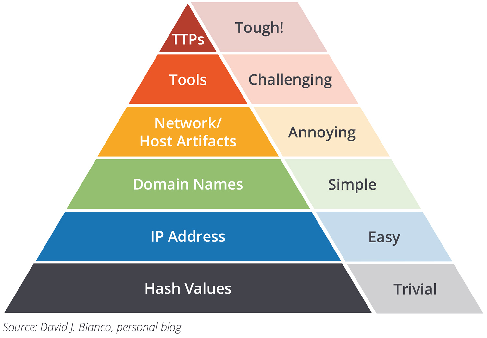

# Threat Hunting

CPSC 4810

## You Can Find These Presentations Online

Visit [cucyber.net](https://cucyber.net/) to find these presentations and more online!

Material: <a href="https://tldrlegal.com/license/creative-commons-attribution-sharealike-4.0-international-(cc-by-sa-4.0)">Creative Commons Attribution-ShareAlike 4.0</a>Code: <a href="https://tldrlegal.com/license/bsd-2-clause-license-(freebsd)">BSD 2-Clause</a>

## Overview

* What is threat hunting?
* Threat hunting methodology
* How to become a threat hunter
* ATT&CK
* Sample Threat Hunt

## What is Threat Hunting?

Note:
* Does anyone have any ideas what threat hunting might mean?

### Threat Hunting

* Blue Team
* Easier to define by saying what it ISN'T
  * It's not a SOC
  * It's not threat intelligence
  * It's not incident response
  * It's not forensics

### Threat Hunting

Note:
* People try to define it in a number of ways, but it's really just blue team detective work.

### Threat Hunting

* "Searching through networks to find threats"

Note:
* That's as broad as "the job description of a hacker is one who hacks things"

## Methodology

* There isn't one!

### Methodology: What's needed

* Sherlock uses clues to find bad guys
* We need clues in order to find our bad guys
* What are clues that we can use?

Note:
* Logs!
* Network traffic
* Much more

### Threat Hunting

* A threat hunter is someone who uses "cyber clues" to find bad guys

Note:
* "Cyber clues" is the dumbest thing I've ever typed out
* We must act like a detective

### Methodology

1. Make a hypothesis
2. Use data to confirm or reject hypothesis
3. Repeat

Note:
* You really never "reject" a hypothesis, but just say that you don't have enough information
* Example hypothesis: "Hackers are creating .bashrc backdoors on our network"

### Methodology

Note:
* From easiest to hardest
* TTP is tactics, techniques, and procedures
* Threat hunters don't really work on the bottom half

## What Makes a Good Threat Hunter?

* Practice with tools
* Red team mindset

## ATT&CK

Note:
* Lists TTPs
* Useful for making hypothesis
* You'll see this a lot in industry

## Sample Threat Hunt

* Hypothesis: "We have machines in our organization contacting C&C servers"
* How should you test this hypothesis?

### Pain Triangle

* Hash values
* IP Address
* Domain Names
* Network/Host artifacts
* Tools
* TTP

Note:
* 5 mins to try it out
* Hash values of known C2 agents
  * Where might this fail?
* Known malicious IPs
  * What sources would we look at?
  * Where mighht this fail?
* Domain names
* What host artifacts should we get?
* Tools
* TTP
  * (Un)common Protocol/(Un)common port
