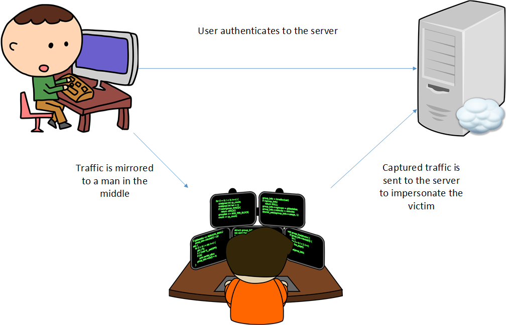

# Replay Attacks

By: Weston Belk, Nick Bulischeck, Foster McLane

CU Cyber

## You Can Find These Presentations Online

Visit [cucyber.net](https://cucyber.net) to find these presentations and more online!

## What is a replay attack?

* Man-in-the-middle (mitm) attack
	- Someone is sniffing your traffic
	- Via proxy, arp poisoning, wireshark, or malware
* Resubmitting (replaying!) your valid packets

## How it works

1. Client sends server a packet
2. The server and the hacker receive a copy of the packet
3. The server responds to the client (SUCCESS)
4. The hacker sends the server a copy of the original packet
5. The server responds to the hacker (SUCCESS)

## What are the dangers?

* Hacker can replay your login
	- Red team is now in your account
	- Compromised user may be blamed
* Online purchases can be replayed
* Server doesn't know the difference

Note:
Services such as PayPal and Stripe use cryptography to ensure transaction time and source.

## Preventing Replay Attacks

* Timestamps
* Session logic
* Encryption (SSL)

## Timestamps

* Only allow communication within a certain time of the last communication
* Vulnerable if replay attack is carried out quickly enough

## Session Logic

1. Server sends the client a nonce (number used one)
2. Client replies with its information and the nonce
3. If the server isn't expecting that nonce or it sees it has been used before then it rejects it

## Encryption (SSL)

* TLS handshake has some nonce concepts built-in
* Still vulnerable to man-in-the-middle proxies

Note:
#### TLS Handshake
* Random values are exchanged in the initial handshake
#### Web Proxies
* Tools like Burp Suite and Postman which allow you to see the unencrypted version of your web requests
* Could be weaponized as malware and is difficult to detect

## Watch out for SSL Stripping

* SSL stripping is a mitm attack which differs from replay attacks
	- HTTPS traffic is routed to HTTP
	- Forces you to communicate in plaintext
	- You may not notice because the browser won't throw errors
	- This is no longer a replay attack
* The solution to SSL stripping is HSTS

Note:
* You are actually talking to the mitm who has the the real connection with the server.
* He just forwards you the traffic after you send him the unencryted one.
* HSTS prevents HTTPS to HTTP downgrading.

## Protecting your webapp

* Use session logic
* Use HTTPS and HSTS
* Leave cryptography to the experts (please!)

Note:
* Generally session logic and HTTPS are enough to stop replay attacks.
* As always, when it comes to encryption use a library.
* Don't. Roll. Your. Own.

## Other Methods

* There are more advanced challenge/response algorithms
	- Not standard
	- Easy to screw up
	- Computationally expensive
	- Patent issues
* Password Authenticated Key Exchange (PAKE)
	- Demonstrate you know the password without sending it
* I am not a cryptography expert.

Note:
* If you're interested in learning more: SRP (Secure Remote Password protocol).
* Developed at Stanford
* Works around patent issues

## Common Uses

* Undetected nefarious acts
* WEP WiFi cracking (Aircrack-ng)
* [Unlocking your car](https://www.youtube.com/watch?v=Q-OlgVLHIDs)

## Common Tools

* tcpdump/Wireshark
* Mitm proxies like Burp Suite or Postman
* Ettercap

# Demonstration

# Questions?
